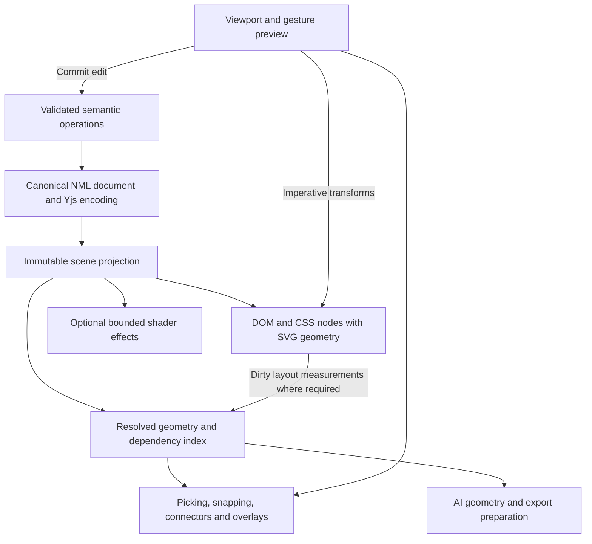

# Canvas parity roadmap

Build toward Figma Design parity by extending the existing NML document model, DOM/CSS renderer, SVG geometry, and imperative interaction engine. The current pan/zoom architecture is an asset. The largest investments should be selection correctness, agreement between layout and geometry, editable visual fidelity, and reusable design systems.

Paper validates the web-native direction. OpenPencil provides inspectable implementations and useful engineering patterns. Neither is a complete specification for Figma parity, and neither establishes that replacing this canvas with a new renderer would improve it.

## Scope and evidence

This roadmap covers Figma Design's editing workflows, layout, typography, vectors, reusable assets, variables, prototyping, collaboration, and developer handoff. It includes the connector workflows relevant to Nootles diagrams. Separate Figma products such as Sites, Slides, Buzz, and Make, and compatibility with every third-party plugin, are outside the initial target. Advanced illustration and motion capabilities remain an explicit later tier.

The code baseline is Nootles `a1ea966bc96d80dc5f026377f933b3ef16f31a63`. OpenPencil was inspected at `5676fc26e7ed893a512991ccbcbbcb7987456c92`, and Paper Shaders at `7002061d8389781a45e479584deeca0cf538474e`. Public documentation was checked on September 13, 2026. Findings describe source and documentation, not measured performance: no comparative runtime benchmark was conducted. Recommendations and numeric budgets below are proposed acceptance criteria.

The existing [rendering parity plan](/Users/alihosseini/Documents/GitHub/nootles/docs/figma-parity-plan.md) remains useful for property-level work. Its scope explicitly excludes components, most variables, prototypes, and several professional workflows. This roadmap expands that scope and identifies architectural decisions that its original rules cannot accommodate. It does not silently change those rules or declare its unfinished phases complete.

## 1. What Paper actually demonstrates

### The canvas and WebGL are different layers

Paper describes its canvas as real HTML/CSS and its visual effects as a combination of shaders, CSS filters, backdrop filters, and shadows. Its comparison page distinguishes that architecture from the separate product Pencil's WebGL canvas. Pencil and OpenPencil are different projects. Public evidence does not establish that Paper renders its whole document through a proprietary WebGL engine. Its internal scheduling, culling, layout caches, and compositor integration remain undisclosed. [P1]

There is inspectable Paper rendering code: the separately published Paper Shaders library. It mounts a WebGL2 canvas into an HTML element. That proves how the published effects work; it does not reveal the closed editor's implementation. [P2]

| Public shader implementation | Why it helps | Application to Nootles |
|---|---|---|
| A full-surface quad feeds a fragment shader | Rich visual effects can be expressed without creating thousands of DOM elements | Use a bounded effect surface for procedural texture, distortion, or animated fills |
| Uniform locations and values are cached | Unchanged parameters avoid repeated upload work | Update only changed effect parameters |
| Static shaders stop their animation loop | A static design incurs no recurring animation work from that shader | No always-running loop for a static board |
| Offscreen and hidden-document effects pause | Invisible animation does not consume the same work as visible animation | Combine scene visibility with document visibility and reduced-motion preferences |
| Render resolution adapts to device pixels and a pixel cap | Quality and cost can be controlled independently of CSS dimensions | Budget effects by physical pixel area, not just node count |
| Explicit texture disposal and optional mipmaps | Resource use is managed across updates and scaling | Give every image/effect cache a clear owner and eviction policy |

These observations come from `ShaderMount`, including its default 8,294,400-pixel cap; that is a per-effect library default, not an appropriate universal budget for an entire editor. [P2]

Visual quality also involves edge treatment and color interpolation. For example, Paper's halftone shader uses derivatives to smooth edges, and its shader helpers implement perceptual color mixing. These are examples of deliberate quality work, not proof of exact colorimetry throughout the editor. [P3]

### The product lessons

Paper's strongest transferable idea is continuity between the design representation and the web. Its typography, CSS-based values, code-oriented workflows, and effects make the design useful beyond its canvas. The recommendation for Nootles is to preserve authored CSS values and layout intent through editing, import, and export, with explicit translation only where NML geometry or editor relationships require it. [P1], [P4]

Paper's token documentation covers colors, spacing, radii, sizing, and typography. It still lists theme modes and reusable theme classes as future work, and cross-file token copies are independent. Its roadmap also labels components with slots and CSS Grid as upcoming work. This is a useful direction, but not evidence of complete design-system parity. [P5], [P6]

Its HTML paste documentation is unusually instructive: only inline styles are supported; class-based styling is discarded; rich text is currently translated into a restricted representation. Nootles already has a richer canvas label grammar, so copying Paper's restrictions would lose existing capability. [P7], [N5]

Paper's recent releases put substantial effort into interaction details: selecting layers beneath a cursor, gap/padding and gradient handles, minimal UI, flex wrapping, and comments. These are strong priorities for a professional editor. Its vector documentation distinguishes current path editing from planned boolean and vector-network workflows; the build log is the better source where older roadmap wording conflicts with newer releases. [P8], [P9]

### What cannot be concluded

There is no public evidence here for Paper's whole-editor frame rates, maximum practical node counts, exact memory model, or a secret WebGL technique responsible for its smoothness. The browser already performs rasterization and compositing for HTML/CSS. Restricting navigation to transforms can avoid layout and paint work, while indiscriminate layer promotion can increase cost. This supports preserving Nootles' existing approach, with measurements governing changes. [W1], [W2]

## 2. What OpenPencil's code offers

OpenPencil uses a retained scene graph with Skia/CanvasKit rendering, Yoga-based layout, and a Vue editor shell. It has separated scene-graph, file-format, engine, DOM/CSS import, and SDK packages. Its architecture is valuable to study at the level of commands, semantics, dependency tracking, and testing. Its renderer and layout stack would constitute a substantial change to Nootles' mechanism. [O1]

| Area inspected | Evidence and current limits | Transfer to Nootles |
|---|---|---|
| Navigation and rendering | Renderer state tracks page, scene, font, position-preview, and navigation versions. It has retained backing and an opt-in tiled path | Explicit invalidation domains and cancellation of obsolete work |
| Scheduling | Editor-scoped frame scheduling deduplicates pending callbacks; scene and overlay updates are distinguishable | Keep viewport and transient UI separate from committed document edits |
| Retained quality | Cached content supports navigation; exact content is settled after navigation. Cache allocation and build work have budgets | Preserve gesture-time smoothness and verify final crispness separately |
| Layout impact | Mutation impact records changed nodes and old/new parents; layout scopes are compacted | Recompute affected subtrees and layout ancestors instead of the entire scene |
| Selection | Separate scoped and deep selection; inverse matrices support transformed ancestors; clipping gates child traversal | Shared coordinate/clip semantics and explicit selection policy |
| Selection limitation | The inspected scene-graph hit test is largely box-based, including leaf nodes | Do not assume it solves painted-shape picking, holes, or every overlapping-layer case |
| Components | Instances, variant/property operations, and explicit per-field descendant overrides exist | Stable definition identity and an override model that survives master edits |
| Component libraries | Publication revisions, catalogs, selective publishing, dependency materialization, and instance updates exist; these are ahead of the roadmap | Study the actual publish/update workflow; distinguish component libraries from a complete shared token/style service |
| Variables and styles | Collections, modes, bindings, and shared-style structures exist; coverage varies by UI field | Typed bindings, aliases, dependency tracking, and gradual inspector coverage |
| Geometry and paint | Vector networks, boolean operations, masks, gradients, strokes, effects, and detailed text/import machinery are present | Geometry algorithms, edge-case fixtures, and explicit fidelity policies |
| Interchange | Format adapters separate document read/write from node/page/selection export; `.fig` codecs preserve source metadata | A format capability registry and preservation of unsupported source data |
| Automation | UI, SDK, CLI, MCP, and Figma-like API surfaces share core capabilities | Keep AI and human edits on the same validated operations |
| Quality tooling | Navigation recordings, traces, render profiling, visual oracles, import/round-trip tests | Adopt the test methodology early |

Source groups: rendering and scheduling [O2], [O3], [O4]; layout/selection [O5], [O6]; components and variables [O7], [O8]; interchange [O9]; feature coverage and limitations [O10].

Two caveats matter. First, available fields, preserved import metadata, and a working authoring UI are different levels of support. OpenPencil's roadmap explicitly distinguishes those levels and identifies prototyping as unimplemented. Second, a repository-wide search of the inspected editor packages found UI hiding, but no implemented native `EyeDropper` or Fullscreen API workflow. Those features still need their own Nootles design. [O10], [O11]

The deeper read also found reasons to adapt these implementations carefully:

- Component instances are linked cloned subtrees. Nootles' proposed definition-plus-resolved-tree model below is an architectural recommendation, not a description of OpenPencil. Variant authoring is substantial, but preserving every arbitrary descendant override across a swap is not established. [O7]
- Retained rendering has a synchronous rebuild path as well as an incremental path. Its 6 ms incremental budget yields between top-level children, so a single expensive subtree can exceed it. A named budget is not proof that all jobs are interruptible. [O2]
- The HTML/CSS export projection uses the first fill/effect and maps non-empty layout modes, including grid, to flex. SVG export maps diamond gradients to radial gradients. These concrete losses make it unsuitable as a fidelity oracle for Nootles' native CSS export. [O13]
- Navigation metrics need adaptation: the inspected drift calculation uses the last wheel anchor across updates, while Nootles has an embedded viewport origin. Use per-input/frame identities and canvas-relative coordinates. Application settlement and presentation of sharp pixels must remain separate measurements. [O14]

OpenType editing, existing-mask type controls, component libraries, and multidimensional variant authoring have implementation beyond some roadmap cells. Arbitrary variable-font axis controls, complete plugin hosting, and a full prototype runtime should not be inferred from import fields or Figma-like API names. [O7], [O10], [O15]

The default rendering mechanism should stay ours. Useful candidates for selective reuse include format codecs, geometry helpers, source-preservation policies, and test patterns. Evaluate each behind an adapter; importing all of `@open-pencil/core` would pull in a much broader architecture. OpenPencil is MIT-licensed; Paper Shaders is Apache-2.0-licensed. Retain the relevant notices if code is reused and inspect the selected packages' dependency licenses. [O12], [P10]

## 3. The actual Nootles starting point

| Area | What exists | What this does not yet establish |
|---|---|---|
| Document | Canonical custom-element markup, attributes for geometry, CSS style maps, stable node IDs, parser/serializer/schema | General HTML or arbitrary CSS authoring parity |
| Camera | External viewport controller; direct transform on one scene layer; temporary `will-change`; local counter-scaling | A measured performance envelope for large design files |
| Editing | Imperative gesture previews, typed operations, structural sharing, memoized node rendering, history brackets | Complete Figma interaction semantics |
| Layout | Actual flex/grid rendering plus a memoized model-only layout evaluator | Agreement for every CSS unit, track, intrinsic size, and transform |
| Picking | Geometry hit chain, entered-group selection, marquee, hidden/locked filtering | All layers under a point, precise path/stroke/mask picking, complete paint-order agreement |
| Visuals | Rects, ellipses/arcs, polygons, text, images, paths, groups, editable booleans, paint/effect panels | Full multi-paint, mask, image-editing, and compositing fidelity |
| Text | Styled runs, paragraphs/lists, range editing, font loading, size measurement | International-input and typography acceptance across supported browsers |
| Reuse | CSS color variables | Components, variants, typed collections/modes, libraries |
| Collaboration | Canvas-specific Yjs binding and presence; newer canonical NML command/bridge implementation also exists | Completed production adoption of the newer canonical bridge |
| Interchange | NML clipboard, Figma plugin converter and tests, image inlining | Complete `.fig` interchange, export panel, or universal HTML snapshot import |
| Workspace | Active-canvas shell and window-owned toolbar/inspectors/layers | Focus mode and browser fullscreen with correct portal/focus behavior |

Implementation references: document [N1]; viewport [N2]; gestures/store [N3]; layout and picking [N4]; text [N5]; variables [N6]; collaboration/NML adoption [N7]; plugin [N8]; shell [N9]. These are implementation findings, not declarations that existing features have passed a new parity suite.

Three corrections to the earlier survey should guide implementation:

1. `laidOutScene` is computed by our own layout evaluator; it is not a general cache of browser-measured layout. The visible DOM and this evaluator can diverge.
2. Canonical markup round-trips exactly. Arbitrary input HTML is normalized, so literal byte preservation is not the general contract.
3. Reading a node's fill is an authored-style picker. It cannot substitute for sampling the visible pixel of an image, gradient, or composited scene.

Several existing details should prevent duplicate work: the path parser already accepts SVG arc commands and multiple subpaths, while the pen's editable model currently exposes the first subpath. The plugin already emits angular/diamond gradient representations and converts stars to paths; that does not make those values fully editable through the current gradient/shape controls. Icons already compile to ordinary path nodes. Canvas clipboard serialization currently creates an empty diagram style, so carrying referenced variables is a concrete dependency-transfer gap. [N8], [N11]

## 4. Architecture to preserve and extend

### Invariants

1. NML remains the portable document representation. The canonical typed model and collaborative encoding own durable state; DOM, geometry caches, GPU resources, and view state are projections.
2. Appearance uses real CSS/SVG wherever those standards express the intended result. Geometry and editor relationships use explicit NML semantics. No parallel JSON scene becomes the authority.
3. Pan and zoom remain camera transforms. A camera update must not dispatch a document operation, serialize NML, rebuild layout, or re-render every shape.
4. Gestures retain a transient preview followed by a semantic commit. One continuous user action produces one undo group. Collaboration may broadcast throttled previews separately.
5. Selection, overlays, connectors, snapping, and AI geometry queries consume the same resolved geometry revision.
6. Cached or approximate display is never silently treated as exact data for export, snapping, or document mutation.
7. New capabilities preserve existing canonical documents. Features requiring new relationships receive explicit schema/capability versioning and older-client behavior.

### Proposed runtime boundaries

These are ownership boundaries, not a requirement to replace existing modules. Introduce abstractions only when a concrete feature needs them.

### Resolve layout agreement before expanding CSS support

The existing evaluator is fast and useful for headless operations. Keep it for the subset it can resolve faithfully, and make that subset explicit. Add a versioned geometry snapshot containing local layout boxes, world/inverse transforms, clipping ancestry, paint order, visual bounds, and dependency information.

For richer CSS, the recommended extension is a browser measurement adapter for dirty layout roots. The browser is authoritative for those roots; the evaluator can supply a prediction while their measurement is pending. A root must have one declared authority at a time, and consumers receive one coherent snapshot. Do not merge arbitrary fresh and stale boxes without revision checks.

The measurement path should:

- Run because content, style, font availability, assets, or a layout container changed. Camera movement alone does not invalidate layout.
- Batch writes, then reads. Reconcile the smallest layout roots and affected ancestors; avoid repeated alternating read/write loops.
- Collect local boxes and compose transform matrices correctly. Inverting a rotated axis-aligned `getBoundingClientRect()` does not recover the original box.
- Use resize/font/image signals as invalidation inputs, not as permission for every node to measure continuously.
- Update geometry, picking, and overlays together. During an unresolved reflow, keep a consistent preview and suspend exact snapping against stale targets.
- Let headless callers use the supported evaluator or explicitly await a browser-backed measurement service. Never return an estimate as an exact measurement.

This is a proposed revision to the old plan's blanket prohibition on DOM geometry reads. It preserves the hot camera path. If a measurement prototype cannot meet the budget, constrain that feature's accepted CSS until it can; do not ship visibly misplaced hit boxes. An alternative that forces all DOM children into our evaluator's absolute positions would sacrifice native browser layout behavior and is not the recommended default.

### Separate geometric bounds from visible paint

Create a common query service rather than separate rules in selection, snapping, connectors, and hover:

- Broad phase: an incrementally updated spatial index over conservative world bounds.
- Narrow phase: rect corner geometry, ellipse/arc/ring geometry, paths and strokes, boolean results, and clipping/mask rules.
- Selection policy: normal group selection, deep selection, menu candidates, marquee, and drop targets are different queries over the same geometry.
- Paint policy: visual order follows supported CSS stacking and renderer order. Layout order is a separate concept.
- Geometry lifetime: changes to a node, its layout ancestors, its mask, or its component definition invalidate its dependent entries. Zoom changes screen-space tolerance, not the index's world-space boxes.

Tolerance is specified in screen pixels and transformed appropriately. Paths can use cached flattened segments or cached `Path2D` tests on a small geometry-only context; that does not make Canvas2D the document renderer. Image objects should have an explicit rectangular-selection policy unless a separate painted-pixel mode is intended. Shadows generally enlarge visual/culling bounds without becoming the default selectable shape.

For arbitrary unsupported CSS masks, transforms, or stacking behavior, preserve the value and surface the capability limit. A raw browser `elementsFromPoint()` list still does not resolve transparent box interiors or every SVG/CSS effect into the desired editor selection policy.

### Make invalidation proportional to the edit

Track mutation categories: transform, layout, paint, text metrics, structure, definitions/tokens, and presence. A paint-only change should not rerun layout. A moved shape should only refresh its dependent edges, affected index entries, and relevant overlays. A token or component edit may legitimately affect many nodes; resolve those dependents incrementally and publish a consistent revision.

The document store remains authoritative at commit. The preview layer owns temporary DOM writes until commit/cancel, then clears them. Every preview needs rollback for Escape, pointer cancellation, lost capture, deleted targets, and conflicting remote edits. Do not add a second persistent state path for each new tool.

## 5. Parity inventory and target behavior

“Done” requires representation, rendering, editing, history/collaboration, interchange behavior, and acceptable performance. Preserved but uneditable import data is tracked separately. Each row below needs a fixture and a named owner during implementation.

| Capability | Current assessment | Required target | Phase |
|---|---|---|---|
| Pan, pinch, wheel, hand, zoom commands | Strong foundation | Retain feel; test focal anchor, momentum, reversals, browser zoom/DPR | 0, all |
| Focus, minimal UI, fullscreen | Missing canvas workflow | Expand board, hide chrome independently, optional browser fullscreen, reliable return | 1 |
| Select visible lower layer | Incomplete | Stroke-only/transparent interiors fall through; precise geometry and clip rules | 1–2 |
| Deep and overlapping selection | Partial | Cmd/Ctrl deep select, Select layer menu, keyboard tree navigation, optional cycling | 1 |
| Marquee and mixed selection | Present/partial | Consistent nested/locked/hidden behavior, bulk properties, matching selections | 1–2 |
| Move/resize/rotate/scale/duplicate | Present | Modifier parity, world-preserving reparent, no accidental selection/drag jumps | 1–2 |
| Alignment, distribution, smart selection | Partial | Equal gaps, tidy-up, repeated duplication, measurement overlays | 2 |
| Rulers, guides, layout grids, pixel grid | Gap | Editable guides, frame grids, snapping controls, device-pixel inspection | 2 |
| Frames, groups, sections | One group kind | Distinct semantic behavior without coupling identity to fill or layout style | 2 |
| Frame constraints | Incomplete | Pin, center, stretch, scale per axis; clipping and nested transforms | 2 |
| Auto layout | Useful subset | Row/column/wrap, fixed/hug/fill, min/max, baseline, absolute children | 2 |
| CSS Grid | Partial | Explicit/implicit tracks, spans, per-axis gaps, safe intrinsic sizing | 2 |
| Responsive design | Limited | Resizable frame previews; token/mode and breakpoint intent preserved | 2, 5 |
| Solids and multiple fills | Present/partial | Independent fill editing, visibility, opacity, blend, reordering | 3 |
| Gradients | Partial | Linear/radial/conic, multi-stops, on-canvas handles, documented diamond/shear mapping | 3 |
| Strokes | Partial | Multiple strokes, per-side widths, joins/caps/dashes, placement, markers | 3–4 |
| Eyedropper | Missing | Pixel sampling where supported, honest fallback, correct fill/stroke/run destination | 1, 3 |
| Color | CSS values accepted, editor normalizes some | Preserve wide-gamut/perceptual values; explicit conversion and interpolation | 3 |
| Images | Basic nodes/fills | Fill/fit/crop/tile, replace, focal position, adjustments, asset lifecycle | 3 |
| Effects | Several already implemented | Exact tested bounds/isolation; vector shadows; measured blur cost | 3–4 |
| Masks and clipping | Some import/render support | Editable alpha/vector/luminance masks, nested scope, select-through rules | 4 |
| Boolean geometry | Present | Accurate curve-aware results, editable operands, flatten and outline stroke | 4 |
| Pen and path editing | Present; first-subpath editing limit | Anchor/segment editing across subpaths, join/split, winding, arc preservation tests, flipping, robust history | 4 |
| Diagram connectors | Elbow routing and end arrow | Straight/elbow/curved routes, free endpoints, automatic/manual anchors, caps, labels, waypoints | 2, 4 |
| Vector networks | Gap | Preserve editable topology with stable vertices/edges/regions | 4, later depth |
| Stars and smoothed corners | Gap/partial representations | Parametric control, shared render/hit geometry, tested smoothing approximation | 4 |
| Text runs and blocks | Strong existing work | Protect it; extend typography and interaction coverage | 3 |
| Fonts, variable axes, OpenType | Partial | Discovery/fallback, local/uploaded fonts, axes/features, asset-ready geometry | 3 |
| International text | Browser advantage, needs acceptance | IME, graphemes, RTL/bidi, CJK, emoji, lists, browser undo integration | 3 |
| Text on paths/advanced illustration | Gap | SVG-based editable support or explicit outlined import tier | Later |
| Components and instances | Missing | Masters, instances, nested overrides, detach/reset, go-to-main | 5 |
| Variants/properties/slots | Missing | Variants, text/boolean/swap properties, slot constraints and stable identities | 5 |
| Variables and modes | Color variables only | Typed variables, aliases, collections, scopes, modes, safe rename/delete | 5 |
| Shared styles and libraries | Missing canvas system | Reusable style bundles, library versions, update review, missing-source handling | 5, 7 |
| Figma import | Plugin and conversion tests | Preserve hierarchy/assets/intent, structured diagnostics, optional `.fig` adapter | 6 |
| HTML/SVG import | NML-focused | Sanitized editable import, explicit CSS subset, source provenance | 6 |
| Clipboard | NML copy/paste | Multiple formats, paste in place/replace/style, cross-board remapping | 1, 6 |
| Export | Gap as a complete workflow | PNG/JPEG/WebP/SVG/PDF, scales, multiple frames, clipping/effects policy | 6 |
| Code handoff | NML foundation | HTML/CSS, React, optional Tailwind; assets/tokens; inspect and measurements | 6 |
| Prototype navigation | Missing | Flows, triggers/actions, overlays, scroll/fixed/sticky behavior | 7 |
| Prototype state and animation | Missing | Variables/conditions, interactive variants, matched-node animation, easing/springs | 7 |
| Collaboration | Existing Yjs/presence | Reliable concurrent canvas operations, comments anchored to nodes, follow mode | All, 7 |
| History/recovery | Existing mechanisms | Local-origin undo, durable recovery, named versions and targeted restore | All, 7 |
| Automation | Existing AI bridge | Same commands as UI, capability discovery, batch edits, exact/estimated geometry distinction | All, 6 |
| Accessibility | DOM opportunity | Keyboard editor/layers, accessible controls, focus restoration, reduced motion | All |
| Large boards | Unmeasured envelope | Scoped recomputation, selective mounting, bounded caches and asset decode | All, 8 |
| Procedural effects/media | Optional extension | Bounded shader/media nodes with export fallbacks and paused idle work | Later |

Figma's documented selection interactions, components, grid auto layout, and variable modes ground the corresponding targets. The remaining entries are an implementation backlog, not a claim of byte-for-byte compatibility with Figma's proprietary internals. [F1], [F2], [F3], [F4]

## 6. Delivery plan

### Phase 0 — Establish a performance and fidelity baseline

Build a small isolated canvas fixture route and a repeatable acceptance harness before touching camera behavior. Extend the existing isolated NML/canvas browser harness where practical. Reuse existing canvas, plugin, and NML tests; add the missing browser interaction and reference-render cases.

Create five fixture families: a small diagram; a large flat board; nested product UI with real text/images; paint/mask/effect stress; and representative Figma imports. Include one Nootles document containing several diagrams, with one active editor and the others embedded. Use deterministic IDs, fonts, and assets.

Record physical trackpad input for slow pan, momentum, diagonal pan, reversal, slow pinch, fast pinch, and pinch reversal. Replay for deterministic regressions, but retain manual hardware acceptance. OpenPencil explicitly distinguishes synthetic input from real trackpad evidence and checks exact settlement rather than sleeping for an arbitrary interval. [O3]

Create visual oracles from authorized Figma fixture exports and browser screenshots. Compare geometry, text wrapping, and appearance separately. Small anti-aliasing differences should not obscure a wrong line break or missing mask.

Deliverables: baseline artifacts, capability checklist, fixture route, measurement marks, visual fixtures, and a release gate. Initial grammar changes are unnecessary.

Exit: current behavior is reproducible, existing regressions are named, and every later phase can demonstrate whether it changed navigation cost or visual fidelity.

### Phase 1 — Fix daily interaction and deliver the three immediate gaps

**Selection.** Add an all-candidates query to the existing geometry service. It must continue through overlapping siblings, retain ancestry, and distinguish menu candidates from the normal click result. Fix transparent/stroke-only geometry for the common rect/path/ellipse cases. Respect clipping, hidden/locked ancestors, and screen-space tolerance. Layer menus should preview hovered candidates and select by stable ID.

Use Figma's documented Cmd/Ctrl deep select, Enter/Shift+Enter hierarchy navigation, and Tab/Shift+Tab sibling navigation. Preserve Alt-drag duplication and avoid conflicts with text editing or browser shortcuts. Optional under-layer cycling is useful, but should be described as an added convenience rather than assumed to be the entire Figma rule. [F1]

Acceptance examples: an outline rectangle around a button does not consume a click inside the button; a ring's empty center does not steal a click; a child outside a clipped frame cannot be selected through the clip; a named layer under three overlaps is reachable by menu and keyboard; hover and click choose consistently at 10%, 100%, and 800% zoom.

**Focus/fullscreen.** Implement three independent concepts: expanded workspace editing, minimal chrome, and optional browser fullscreen. Preserve the same scene/selection/history stores and viewport, and retain the mounted surface where practical. Restore document scroll, focus, and camera on exit. Avoid resizing persisted `w/h` just because the editor occupies more screen space.

Because our panels are owned by `Workspace`, expanding only the block is insufficient. The focused host must coordinate toolbar, layers, inspector, menus, color popovers, dialogs, and portal roots. Fullscreen descendants must include the usable chrome. Handle Escape according to active submode, browser `fullscreenchange`, request failure, navigation away, and read-only use. CSS transforms on ancestors can also change how a fixed overlay behaves. [N9], [W3]

**Eyedropper.** Introduce a shared color-pick session used by fill, stroke, gradient stops, text runs, and effects. Feature-detect the browser EyeDropper API and invoke it from a user action. Treat cancellation as no edit; commit one history operation on success. The native result is sRGB, so it cannot preserve an authored Display-P3 value or a CSS variable reference. [W4]

Provide a separately named authored-color picker as the universally useful fallback. Preserve the token/reference when desired. For actual scene-pixel picking in unsupported browsers, prototype a one-time snapshot of the stable visible region, omit editor overlays, then sample that image. Do not promise universal exactness: arbitrary DOM is not a standard `drawImage()` source, CSS-to-image pipelines have fidelity limits, and cross-origin assets can prevent readback. Keep explicit unsupported states; never silently return a guessed fill as a sampled pixel. [W5], [W6]

Complete pointer cancellation, shortcut focus guards, paste placement, and mixed-selection behavior in the same interaction pass. Core files: `geometry.ts`, `useSelection.ts`, `shortcuts.ts`, `ContextMenu.tsx`, `ColorField.tsx`, `CanvasSurface.tsx`, `shell.tsx`, and `Workspace.tsx`.

Exit: all three reported gaps have usable workflows, the selection fixtures pass, and camera/scene performance remains within baseline gates.

### Phase 2 — Frames, transforms, layout, guides

Introduce explicit group/frame/section semantics using a small, versioned NML relationship field. A frame can be transparent; a group can have a fill. Inferring identity solely from appearance is insufficient. Existing documents retain their current behavior until an explicit conversion.

Unify transforms for rendering, hit testing, resize handles, snapping, and reparenting. Moving a node between rotated or flipped parents must preserve its world transform. Keep layout order distinct from visual stacking; reversing flex direction is not a general z-order operation.

Implement the geometry snapshot and incremental invalidation described above. Expand flex and grid in fixture-driven increments: fixed/hug/fill; wrap; min/max; per-axis gaps; baseline; out-of-flow children; grid tracks/spans; constraints; clipping. Preserve authored percentages, `calc()`, and `var()` instead of replacing them with measured pixel values.

Add frame presets, guides/rulers, grid editing, pixel snapping, distance measurement, distribution/tidy-up, and live padding/gap handles. Snap searches should reuse spatial queries and precomputed gesture targets. Auto-layout reorder previews must preserve placeholder space and commit one structural change.

Keep diagram connectors first-class while frames become more capable. Add straight/elbow/curved routing, draggable free endpoints, automatic or pinned anchors, start/end markers, and editable label placement. Route from the same resolved geometry and keep edge IDs stable. A moved node should invalidate its incident edges and genuinely affected obstacle routes, not every edge. Test attachment after frame resize, reparent, clip changes, copy/paste, deletion/undo, and concurrent movement. Manual waypoints and branching relationships can follow with explicit NML attributes/children rather than flattened decorative paths.

Exit: nested product frames resize predictably; browser-rendered boxes, selection, connectors, and snap targets agree across the supported CSS corpus; changing a local subtree does not recompute unrelated boards.

### Phase 3 — Professional paint, images, color, and typography

Extend existing controls rather than replace them. Add on-canvas gradient handles and image crop mode; finish paint-stack editing, per-paint opacity, stroke controls, image replacement/tiling/adjustments, and exact effect-bound handling. Continuous edits use the existing preview/history contract.

Treat color as an authored CSS value with parsed metadata for controls. Preserve Display-P3, OKLCH/OKLab, alpha, gradient interpolation, and variables until an explicit conversion is requested. The current picker parses OKLCH into bounded RGB and writes hex/RGBA; accepted input syntax therefore does not equal preserved wide-gamut editing. [N6]

Audit typography against real browser behavior: variable axes, OpenType settings, line height, paragraph spacing, text resize modes, decoration, fallback fonts, emoji, CJK, Arabic/Persian shaping and bidi, IME composition, selection-scoped style changes, and paste. Font loading invalidates only affected metrics and geometry. A font swap must not leave handles at old dimensions or generate spurious user undo entries.

Test both shape labels and text nodes. Keep native text/IME behavior and the existing rich label model. Do not adopt a custom Skia text editor simply to mimic Figma's rasterization.

Exit: common interface mockups can be authored and edited without leaving the editor, and the visual corpus passes with documented text-rendering tolerances and explicit color-space policies.

### Phase 4 — Vector, mask, and advanced visual fidelity

Strengthen the existing path/boolean stack: edit all subpaths, preserve the already-supported arc grammar through editing, and complete robust anchor/segment selection, join/split/close, handle modes, outline stroke, flatten, parametric stars/arcs, winding rules, and curve-aware bounds. Boolean work should be cached by geometry revision and moved off the input path when expensive. Geometry changes must update hit testing and connectors through the same result. [N11]

Implement editable mask relationships with explicit scope, type, and order. SVG clipping/masks/filters can handle many cases; browser support and isolation behavior need visual fixtures. Keep an editable source graph and a derived render representation. Imported masks that currently become a clip declaration are not equivalent to a first-class mask authoring workflow.

Vector networks require topology that SVG `d` alone cannot preserve. Propose stable vertex/edge/region IDs in NML metadata or typed children, with SVG paths as a deterministic rendering/export projection. This is a real model extension, including operations, schema, history, and collaboration, not simply another pen toolbar button.

Use a bounded shader surface only for effects that justify it. Serialize a stable effect identity and parameters with a standard fallback, never live GPU handles or arbitrary executable shader code from pasted documents. Pause static/hidden effects, cap aggregate pixel area, cancel stale work, dispose resources, and handle context loss. Default budgets need to account for all visible shaders rather than copying Paper's per-node cap.

Exit: vectors and masks remain editable through save/reload/undo/import, visual and pick geometry agree, and effects remain within the measured budget. Advanced path text, variable-width strokes, shape-builder, and sophisticated distortion can follow as separately tracked depth.

### Phase 5 — Components, variables, and design systems

This is the largest semantic extension. Give definitions, instances, styles, tokens, and bindings durable identity within canonical NML. CSS custom properties remain the rendering vocabulary for style values; they do not by themselves encode component ancestry, boolean/text property semantics, modes, or library revisions.

Recommended component model: definitions contain ordinary NML subtrees; instances reference a definition/version; overrides target stable definition-node IDs and property paths; a resolver produces the effective render tree. Derived instance IDs combine instance identity with definition identity. Renaming a layer must not break overrides, and an explicit reset differs from an override whose value happens to match the current default. OpenPencil's override structures make these distinctions concrete. [O7]

Deliver local components, instance insertion, master navigation, nested instances, detach/reset, variants, text/boolean/swap properties, slots, and an assets panel. Preserve unaffected overrides when switching variants. Detect cycles and missing definitions. Definition updates invalidate dependent instances without rebuilding unrelated document roots.

Extend color variables to typed collections, modes, aliases, scopes, and bindings across layout, typography, visibility, and prototype state. Mode values compile to scoped CSS custom properties where applicable; non-style values are resolved by typed operations. Rename/delete must update or diagnose dependencies. Add shared style bundles without creating a second authority for the same CSS declaration.

Start with file-local assets. Add published libraries, pinned revisions, change previews, selective update, conflict handling, missing-source fallback, and explicit fork/detach only after local semantics are stable. Copying a component across documents must include its dependency closure and remap IDs safely.

Exit: a small design system with nested button/card/navigation components, light/dark modes, and local overrides survives master edits, variant changes, concurrent edits, copy/paste, and reload without unintended data loss.

### Phase 6 — Interchange, export, and developer workflow

Run this workstream in parallel as earlier capabilities become representable. Build a capability registry for import/export formats and a common asset pipeline. Continue the existing Figma plugin path first; it already produces our grammar and has conversion tests. Evaluate OpenPencil's `.fig`/Kiwi codecs as optional adapters behind the boundary, with pinned versions and fixture coverage. `.fig` support should not require adopting its scene graph at runtime. [N8], [O9]

For each imported feature, report one of: fully editable; preserved but partially editable; approximated; rasterized; unsupported. Preserve source IDs and useful unsupported metadata with dependency-aware invalidation when a corresponding property changes. Never reapply stale source geometry over an intentional Nootles edit. A paste-and-replace operation must preserve applicable local connections and document identity.

Add editable SVG and controlled HTML/CSS import. Handle fonts, image ownership, CORS, URLs, SVG IDs, and CSS scoping. Importing a webpage snapshot requires a computed-style capture path; accepting inline HTML does not preserve arbitrary stylesheet behavior. Avoid script execution and isolate imported styles from the application UI.

Build export from the same canonical renderer and resolved scene: per-node/frame/selection settings, scales, suffixes, transparent backgrounds, PNG/JPEG/WebP, SVG, PDF, and batch export. Wait for fonts/assets and geometry readiness. SVG/PDF export needs a declared policy for filters, masks, foreignObject text, and raster fallbacks; these formats cannot be assumed to preserve all CSS/browser effects identically.

For handoff, compile NML into ordinary HTML/CSS with SVG where needed, asset references, and tokens. Offer React and optional Tailwind adapters after deterministic HTML/CSS export. Preserve layout relationships rather than exporting everything as positioned screenshots. Component-to-code bindings need explicit IDs and versioning; they are not inferred reliably from matching layer names.

Expose inspectable geometry, distances, styles, assets, tokens, and annotations through the UI and existing AI operation bridge. Add schema/capability discovery and transactional batch edits. Distinguish authored values, computed values, and pending geometry in machine-facing responses.

Exit: representative Figma and HTML/SVG fixtures import with an honest report, remain editable, and export with documented fidelity. Export does not block live panning of an unrelated board.

### Phase 7 — Prototypes, collaboration depth, libraries, and history

Keep prototype state separate from editor and persisted design state. Model flows, targets, triggers, actions, overlay placement, transitions, variable actions, and conditions as declarative NML relationships. Run prototypes in an isolated HTML/CSS view so scrolling, inputs, sticky/fixed elements, and responsive layout can use browser behavior.

Deliver click/hover/key/drag/time triggers, navigation/back, links, overlays, scroll-to, fixed/sticky regions, interactive variants, and variable conditions. Match nodes for animation using stable IDs; interpolate compatible transforms/opacity with Web Animations or CSS, and use an explicit crossfade for incompatible structures. Springs and advanced transitions need their own deterministic timeline and reduced-motion behavior. Neither inspected competitor supplies a complete ready-made prototype implementation. [O10], [F4]

Extend existing Nootles collaboration rather than introduce a second transport. Add canvas comment anchors, follow/presentation mode, read-only inspection, and active-edit awareness. An anchor should survive node movement and produce a recoverable orphan when its target is deleted.

Resolve the production canonical-NML adoption boundary explicitly. Until migration is completed, schema extensions must have a verified projection through the shipping canvas Yjs path. Once adopted, one canonical command/undo authority should own each edit. Do not run two independent undo managers against the same document mutation. Preserve local-origin undo, concurrent move semantics, and deleted-target recovery from the NML foundational decisions. [N7]

There are concrete migration cases to cover: the shipping scene store clears snapshot undo on remote adoption, while the newer canonical bridge rejects same-ID node-kind changes. Before calling flatten, conversion, or collaborative undo complete, give those operations explicit canonical semantics and test their identity/edge/override consequences. Rich-label concurrency, variable collections, library bindings, and ordering all belong in the synchronized document. Rendering performance alone does not establish acceptable serialized update sizes or reconnect cost. [N7], [N12]

Version history should restore selected content through current semantic commands with a preview. Branch/merge and governed library publication are separate later increments; whole-document replacement is not an adequate default for restoring part of a collaboratively edited design.

Exit: a realistic multi-screen prototype works in a browser; two editors can change shared components/text/layout and undo their own work; reconnect and recovery scenarios retain user intent.

### Phase 8 — Scale qualification and rollout

Performance work runs through every phase. This phase qualifies the complete feature set at the chosen document envelope and makes targeted optimizations where measured cost remains.

Virtualize the layers panel and inactive board/page views first. For canvas mounting, start at stable frame/board roots with overscan and hysteresis. Removing individual flex/grid children can change layout; containment can change intrinsic sizing; blending and backdrop filters can depend on content outside an apparent subtree. Pin selected, editing, dragging, focused, and needed mask/layout ancestors. [W7]

Do not make React mount/unmount thousands of nodes during every wheel event. Refresh mounted sets at coarse boundaries, prioritize approaching visible content, and maintain coverage during long pans. Keep text/vector detail sharp after navigation. A huge single composited layer is also not a free solution: pixel area, DPR, image decode, blur surfaces, and texture limits matter alongside DOM count.

Use workers for pure geometry, import decoding, and appropriate export preparation. Browser layout and DOM reads stay on the browser main thread. Tile/bitmap substitutes for whole frames are an optional experiment only if the DOM-first optimizations fail the agreed envelope; they need explicit hit/text/editing/settlement tests before adoption.

Roll out behind independent capability flags with baseline comparisons, existing-document checks, and recovery paths. Do not widen the zoom range until extreme scales pass hit tolerance, precision, text sharpness, and memory tests.

Exit: the complete acceptance corpus passes on the browser/device matrix and the supported capacity is documented from measurements.

## 7. Performance contract

The baseline has not been measured yet. The following numbers are initial engineering targets to calibrate in Phase 0; they are not claims about any product's current performance. A 60 Hz frame is 16.67 ms and a 120 Hz frame is 8.33 ms, with part of that time needed by the browser. [W1]

| Metric | Proposed gate |
|---|---|
| Camera-only document work | Zero scene operations, NML serialization, full-tree layout, or shape React renders attributable to camera updates |
| Main-thread input handler work | p95 under 2 ms on the designated reference device; track maximum stalls separately |
| Application work per active frame | Aim below 6 ms at 60 Hz and 4 ms at 120 Hz, leaving browser headroom |
| Input receipt to camera update | p95 within one refresh interval; measure presentation separately with browser traces |
| Frame pacing | Report median/p95/p99, missed-frame ratio, consecutive misses, and worst stall; average FPS is insufficient |
| Relative regression | Investigate/reject a repeatable >5% degradation on paired baseline/candidate runs for a fixture already within target; allow only measured noise, not an average hiding a bad case |
| Navigation continuity | No visible jumps; focal-anchor drift target at most 0.5 CSS px for deterministic gesture tests |
| Settled quality | Target exact geometry and crisp content within 150 ms after navigation ends on the normal corpus; stress cases get a separately declared budget |
| Idle work | No continuously scheduled scene animation on a static board; no hidden shader/media animation |
| History/persistence | One undo group per gesture; no per-frame serialization or durable presence writes |
| Collaborative scale | Measure update bytes, snapshot size, encode/decode and reconnect time; keep them within the existing NML/transport limits and avoid whole-scene rewrites for local edits |
| Memory | Record DOM, JS heap, decoded assets, estimated effect pixel area, and retained resources; repeated enter/exit/edit cycles return to a stable plateau |

Use release builds, identical assets/fonts, fixed viewport/DPR, real hardware acceleration, a warm-up, and at least five alternating baseline/candidate repetitions. Shared CI runs correctness and coarse regressions; dedicated hardware qualifies timing. Browser traces can show presentation/compositor stalls that JavaScript `requestAnimationFrame` timestamps alone cannot establish. OpenPencil's navigation benchmark is a useful reference for this separation. [O3]

Test on current Chromium, Safari/WebKit, and Firefox; macOS trackpad and Windows mouse/precision touchpad; 60 and 120 Hz where available; DPR 1 and 2; integrated graphics; and constrained mobile/tablet viewing. Feature-detect optional APIs. Touch editing deserves its own acceptance scope rather than inheriting desktop modifier assumptions.

Synthetic capacity tiers should initially include 100, 1,000, 5,000, and 10,000 total nodes, while independently varying visible nodes, DOM descendants, vector segments, text length, image megapixels, effects, and collaborator activity. These are workloads to test, not capacity promises. A thousand simple boxes and a thousand blurred image cards are different workloads.

## 8. Fidelity and document guarantees

Build a matrix with independent columns for model, render, edit, undo/collaboration, import/export, and performance. Preserve-only metadata must not be counted as full parity. Record browser-dependent support explicitly.

Mandatory end-to-end fixtures include:

- Overlapping hollow shapes, masks, rotations, flipped parents, and locked/hidden ancestors.
- Deep auto-layout with wrapping, intrinsic text, grid spans, percentage sizes, tokens, and delayed font load.
- Multi-fill/stroke/effect stacks, alpha and blend isolation, gradients, image crop, and wide-gamut values.
- IME composition, mixed RTL/LTR, grapheme-safe selection, rich paste, lists, and collaborative text changes.
- Nested instances, master deletion, override reset, variant switch, mode switch, missing library, and cross-file copy.
- Local drag versus remote deletion/reparenting; local undo after remote edit; disconnect/reconnect.
- Fullscreen enter/exit with open menus, active text, multiple diagrams, browser Escape, and document navigation.
- Import, edit, save, reload, export, and re-import where that format supports it, with expected-loss diagnostics.

Canonical guarantees are semantic round-trip after normalization, byte-stable canonical serialization, and equivalent Yjs encode/decode. Unknown CSS declarations should survive unrelated edits. Unknown semantic nodes require a capability/version policy, not silent deletion by a parser that does not recognize them. Derived layout caches must not overwrite authored CSS values or become a source of cross-client merge churn. [N1], [N7]

Do not use a single screenshot score as the release decision. Assert geometry and relationships directly; compare images for visual output; compare exported documents for retained semantics; drive actual interactions for behavior.

## 9. Decisions that need to be written down

These are recommended architecture decisions for implementation, not missing information that prevents beginning Phase 0 or the immediate interaction work.

| Decision | Recommendation | Reason |
|---|---|---|
| Main renderer | Preserve DOM/CSS plus existing SVG | Matches the product constraint and current interaction model |
| Layout authority | Exact supported evaluator plus browser-authoritative dirty roots for richer CSS | Avoid an ever-growing, incomplete reimplementation of all CSS |
| Frame identity | Explicit semantic distinction | Appearance alone cannot determine frame/group behavior |
| Definitions and modes | Permit versioned, document-owned NML definitions/relationships | Full design systems cannot fit into per-node appearance declarations alone |
| Paint representation | Native CSS where exact; standard SVG structure or minimal typed extension where necessary | Avoid pretending lossy CSS tricks are lossless editing models |
| Pixel eyedropper | Native API where available, explicit authored-style fallback, separately qualified snapshot sampling | Browser capability and visible compositing matter |
| Shader usage | Optional bounded effects with fallback | Rich effects should not dictate the whole document renderer |
| File formats | NML canonical; `.fig` and HTML/SVG as adapters | Keep interoperability independent of editor internals |
| NML runtime adoption | Name the shipping authority per release and migrate once | Prevent duplicate persistent state/undo paths |
| Performance | Paired reference hardware gates plus correctness CI | Smoothness must remain observable through feature expansion |

Several claims in the old rendering plan should become tested mappings rather than assumed equivalences. Extra `box-shadow` layers do not generally represent arbitrary multi-strokes; changing `flex-direction` does not implement independent paint order; CSS superellipses do not establish an exact Figma smoothing curve; filter composites do not provide exact image tonal adjustments; and CSS backgrounds do not automatically preserve arbitrary gradient transforms or per-paint semantics. Use accurate SVG geometry or explicit approximations where needed. Browser support for newer CSS such as `corner-shape` is also a separate question from matching Figma's output. [N10], [W8]

The old plan's bans on definitions/registries and all DOM layout reads need narrowly scoped revisions for the expanded target. Keep definitions in the NML document rather than a detached parallel file, and allow geometry measurements only behind the controlled adapter. No such revision is required simply to add focus mode or the initial selection fixes.

## 10. Sequence, staffing, and the first reviewable increments

The dependency path is baseline → interaction → shared geometry/layout → visual/vector fidelity → design systems → full prototype/library workflows. Import/export and collaboration validation run alongside the capabilities they consume. Performance is a gate throughout.

Suggested ownership: one editor/interaction engineer; one layout/document/collaboration engineer; one graphics/interchange engineer; and shared product design and browser QA. These roles can be combined on a smaller team, with a longer schedule. The existing NML migration needs coordination with its current owners before introducing new canonical relationships.

| Workstream | Rough engineering effort | Dependencies |
|---|---:|---|
| Baseline, fixtures, instrumentation | 2–3 engineer-weeks | Existing renderer |
| Selection, focus/fullscreen, initial eyedropper, interaction cleanup | 4–7 | Baseline; geometry work may overlap |
| Layout, transforms, frame semantics, guides | 8–14 | Geometry contract |
| Paint, color, images, typography | 8–12 | Layout/geometry stability |
| Vector/mask depth | 6–12 | Shared geometry; source fidelity fixtures |
| Components, typed variables, local styles | 12–20 | Canonical schema/adoption boundary |
| Interchange, export, handoff | 6–10 | Runs incrementally with feature support |
| Prototypes, library workflow, collaboration/history depth | 12–20 | Design-system and command semantics |
| Scale qualification and release stabilization | 4–8 | Continuous work plus final corpus |

These judgment-based ranges total 62–106 engineer-weeks before sophisticated illustration, full branch/merge, and a broad plugin ecosystem. With three experienced engineers and QA/design support, dependencies and stabilization make roughly 6–12 months a more credible planning envelope than a short feature sprint. Re-estimate after Phase 0 and the layout prototype. A much smaller first release can deliver the reported interaction gaps earlier.

The first reviewable increments should be:

1. Baseline fixture route, interaction recordings, performance report, and canonical old-document checks.
2. Selection behavior specification plus failing examples for hollow/overlapping/clipped nodes.
3. Common-case painted geometry fixes, deep selection, and Select layer menu with hover preview.
4. Expanded workspace mode and minimal UI, preserving stores, focus, and viewport.
5. Browser fullscreen integration, including portal roots and Escape/exit recovery.
6. Shared color-pick session, native eyedropper, and explicitly labeled authored-color fallback.
7. Geometry snapshot and layout-drift fixture prototype; decide which richer CSS roots use browser authority.
8. Incremental spatial/dependency indexes and guide/snap consumers on the shared snapshot.
9. Frame/constraint and native layout expansion, one tested capability at a time.
10. Gradient/crop handles and richer color editing through existing history and preview contracts.

Each increment should ship its usable UI and acceptance evidence. The first milestone is an editor where visible objects are selectable, colors can be picked, and a diagram can occupy the screen while preserving the current camera behavior. The later milestones make that editor capable of real design systems and product flows.

## Sources

Source keys identify exact code or documentation used above. OpenPencil and Paper Shaders links are pinned to the inspected commits. Local links refer to the Nootles baseline identified in the scope section. Public product documentation is mutable; where its roadmap and implementation differ, current code and newer dated release notes take precedence.

### Paper

- [P1] Paper, [Paper vs Pencil](https://paper.design/compare/pencil), accessed September 13, 2026. First-party description of HTML/CSS canvas, color, typography, and effect technologies; comparison concerns Pencil, not OpenPencil.
- [P2] Paper Design, [ShaderMount implementation](https://github.com/paper-design/shaders/blob/7002061d8389781a45e479584deeca0cf538474e/packages/shaders/src/shader-mount.ts). WebGL2 mount, lifecycle, resolution limits, uniform/texture handling.
- [P3] Paper Design, [halftone edge treatment](https://github.com/paper-design/shaders/blob/7002061d8389781a45e479584deeca0cf538474e/packages/shaders/src/shaders/halftone-dots.ts) and [shader color helpers](https://github.com/paper-design/shaders/blob/7002061d8389781a45e479584deeca0cf538474e/packages/shaders/src/shader-color-spaces.ts).
- [P4] Paper, [MCP documentation](https://paper.design/docs/mcp), accessed September 13, 2026. Read/write workflows and design-to-code guidance.
- [P5] Paper, [Tokens](https://paper.design/docs/tokens), accessed September 13, 2026. Supported token categories and remaining mode/library limits.
- [P6] Paper, [Roadmap](https://paper.design/roadmap), accessed September 13, 2026. Distinguishes delivered, in-progress, and planned work.
- [P7] Paper, [Paste from HTML](https://paper.design/docs/paste/html), accessed September 13, 2026. Inline-style and rich-text limitations.
- [P8] Paper, [Build Log](https://paper.design/build-log), especially August and June 2026. Shipped interaction, token, comment, layout, and vector improvements.
- [P9] Paper, [Vector editing](https://paper.design/docs/svg), accessed September 13, 2026. Current editing and future vector depth.
- [P10] Paper Design, [LICENSE](https://github.com/paper-design/shaders/blob/7002061d8389781a45e479584deeca0cf538474e/LICENSE) and [NOTICE](https://github.com/paper-design/shaders/blob/7002061d8389781a45e479584deeca0cf538474e/NOTICE).

### OpenPencil

- [O1] OpenPencil, [repository and package map](https://github.com/open-pencil/open-pencil/tree/5676fc26e7ed893a512991ccbcbbcb7987456c92), inspected September 13, 2026.
- [O2] [Renderer state](https://github.com/open-pencil/open-pencil/blob/5676fc26e7ed893a512991ccbcbbcb7987456c92/packages/core/src/canvas/renderer.ts), [render pipeline](https://github.com/open-pencil/open-pencil/blob/5676fc26e7ed893a512991ccbcbbcb7987456c92/packages/core/src/canvas/renderer/pipeline.ts), [retained backing](https://github.com/open-pencil/open-pencil/blob/5676fc26e7ed893a512991ccbcbbcb7987456c92/packages/core/src/canvas/renderer/retained-backing.ts), and [tile scheduler](https://github.com/open-pencil/open-pencil/blob/5676fc26e7ed893a512991ccbcbbcb7987456c92/packages/core/src/canvas/renderer/tiles/scheduler.ts).
- [O3] [Navigation performance benchmark](https://github.com/open-pencil/open-pencil/blob/5676fc26e7ed893a512991ccbcbbcb7987456c92/packages/docs/development/navigation-performance.md) and [renderer lifecycle](https://github.com/open-pencil/open-pencil/blob/5676fc26e7ed893a512991ccbcbbcb7987456c92/packages/docs/development/renderer-lifecycle.md).
- [O4] [Shared canvas render loop](https://github.com/open-pencil/open-pencil/blob/5676fc26e7ed893a512991ccbcbbcb7987456c92/packages/vue/src/canvas/surface/render-loop.ts).
- [O5] [Mutation impact](https://github.com/open-pencil/open-pencil/blob/5676fc26e7ed893a512991ccbcbbcb7987456c92/packages/scene-graph/src/mutation-impact.ts) and [layout runner](https://github.com/open-pencil/open-pencil/blob/5676fc26e7ed893a512991ccbcbbcb7987456c92/packages/core/src/editor/layout-runner.ts).
- [O6] [Scene hit testing](https://github.com/open-pencil/open-pencil/blob/5676fc26e7ed893a512991ccbcbbcb7987456c92/packages/scene-graph/src/hit-test.ts) and [editor selection scoping](https://github.com/open-pencil/open-pencil/blob/5676fc26e7ed893a512991ccbcbbcb7987456c92/packages/core/src/editor/selection/hit-test.ts).
- [O7] [Instance overrides](https://github.com/open-pencil/open-pencil/blob/5676fc26e7ed893a512991ccbcbbcb7987456c92/packages/scene-graph/src/instance-overrides.ts), [component editing](https://github.com/open-pencil/open-pencil/tree/5676fc26e7ed893a512991ccbcbbcb7987456c92/packages/core/src/editor/components), and [library implementation](https://github.com/open-pencil/open-pencil/tree/5676fc26e7ed893a512991ccbcbbcb7987456c92/packages/core/src/library).
- [O8] [Variable model](https://github.com/open-pencil/open-pencil/blob/5676fc26e7ed893a512991ccbcbbcb7987456c92/packages/scene-graph/src/variables.ts) and [shared styles](https://github.com/open-pencil/open-pencil/blob/5676fc26e7ed893a512991ccbcbbcb7987456c92/packages/scene-graph/src/shared-styles.ts).
- [O9] [I/O registry](https://github.com/open-pencil/open-pencil/blob/5676fc26e7ed893a512991ccbcbbcb7987456c92/packages/core/src/io/registry.ts), [Figma format package](https://github.com/open-pencil/open-pencil/tree/5676fc26e7ed893a512991ccbcbbcb7987456c92/packages/fig), and [source metadata](https://github.com/open-pencil/open-pencil/blob/5676fc26e7ed893a512991ccbcbbcb7987456c92/packages/scene-graph/src/source-metadata.ts).
- [O10] [Feature coverage and roadmap](https://github.com/open-pencil/open-pencil/blob/5676fc26e7ed893a512991ccbcbbcb7987456c92/packages/docs/development/roadmap.md). Its status table is checked against implementation rather than treated as infallible.
- [O11] [UI menu schema](https://github.com/open-pencil/open-pencil/blob/5676fc26e7ed893a512991ccbcbbcb7987456c92/src/app/shell/menu/schema.ts) and [editor menu actions](https://github.com/open-pencil/open-pencil/blob/5676fc26e7ed893a512991ccbcbbcb7987456c92/src/app/shell/menu/editor-actions.ts).
- [O12] [MIT license](https://github.com/open-pencil/open-pencil/blob/5676fc26e7ed893a512991ccbcbbcb7987456c92/LICENSE).
- [O13] [HTML/CSS scene projection](https://github.com/open-pencil/open-pencil/blob/5676fc26e7ed893a512991ccbcbbcb7987456c92/packages/dom-css/src/from-scene-graph.ts) and [SVG gradient/filter definitions](https://github.com/open-pencil/open-pencil/blob/5676fc26e7ed893a512991ccbcbbcb7987456c92/packages/core/src/io/formats/svg/defs.ts).
- [O14] [Navigation metrics implementation](https://github.com/open-pencil/open-pencil/blob/5676fc26e7ed893a512991ccbcbbcb7987456c92/tools/navigation-benchmark/src/metrics.ts).
- [O15] [Mask inspector](https://github.com/open-pencil/open-pencil/blob/5676fc26e7ed893a512991ccbcbbcb7987456c92/packages/vue/src/controls/mask/use.ts), [typography control tests](https://github.com/open-pencil/open-pencil/blob/5676fc26e7ed893a512991ccbcbbcb7987456c92/tests/engine/vue/controls/typography-depth.test.ts), and [Figma API compatibility](https://github.com/open-pencil/open-pencil/blob/5676fc26e7ed893a512991ccbcbbcb7987456c92/packages/core/src/figma-api/compatibility.ts).

### Nootles

- [N1] [Scene types](/Users/alihosseini/Documents/GitHub/nootles/app/components/editor/canvas/scene/types.ts), [parser](/Users/alihosseini/Documents/GitHub/nootles/app/components/editor/canvas/scene/parse.ts), and [serializer](/Users/alihosseini/Documents/GitHub/nootles/app/components/editor/canvas/scene/serialize.ts).
- [N2] [Viewport controller](/Users/alihosseini/Documents/GitHub/nootles/app/components/editor/canvas/engine/useViewport.ts).
- [N3] [Scene store](/Users/alihosseini/Documents/GitHub/nootles/app/components/editor/canvas/engine/useScene.ts), [gestures](/Users/alihosseini/Documents/GitHub/nootles/app/components/editor/canvas/engine/gestures.ts), and [ShapeView](/Users/alihosseini/Documents/GitHub/nootles/app/components/editor/canvas/render/ShapeView.tsx).
- [N4] [Layout evaluator](/Users/alihosseini/Documents/GitHub/nootles/app/components/editor/canvas/scene/autoLayout.ts), [geometry and hit testing](/Users/alihosseini/Documents/GitHub/nootles/app/components/editor/canvas/scene/geometry.ts), and [selection](/Users/alihosseini/Documents/GitHub/nootles/app/components/editor/canvas/engine/useSelection.ts).
- [N5] [Label grammar](/Users/alihosseini/Documents/GitHub/nootles/app/components/editor/canvas/scene/label.ts), [label editing](/Users/alihosseini/Documents/GitHub/nootles/app/components/editor/canvas/render/ShapeLabel.tsx), and [font loading](/Users/alihosseini/Documents/GitHub/nootles/app/components/editor/canvas/render/fonts.ts).
- [N6] [Color variables](/Users/alihosseini/Documents/GitHub/nootles/app/components/editor/canvas/panels/colorVariables.ts) and [color parser/writer](/Users/alihosseini/Documents/GitHub/nootles/app/components/editor/canvas/panels/controls/color.ts).
- [N7] [Canvas collaboration binding](/Users/alihosseini/Documents/GitHub/nootles/app/components/editor/canvas/collab/binding.ts), [canonical NML architecture](/Users/alihosseini/Documents/GitHub/nootles/docs/nml-canonical-ast.md), [binding foundational decisions](/Users/alihosseini/Documents/GitHub/nootles/docs/nml-foundational-decisions.md), and [canvas command bridge](/Users/alihosseini/Documents/GitHub/nootles/app/lib/nml/view/canvas.ts).
- [N8] [Figma converter](/Users/alihosseini/Documents/GitHub/nootles/figma-plugin/src/convert.ts), [conversion tests](/Users/alihosseini/Documents/GitHub/nootles/figma-plugin/src/convert.test.ts), and [clipboard commands](/Users/alihosseini/Documents/GitHub/nootles/app/components/editor/canvas/engine/shortcuts.ts).
- [N9] [Canvas shell](/Users/alihosseini/Documents/GitHub/nootles/app/components/editor/canvas/shell.tsx), [surface](/Users/alihosseini/Documents/GitHub/nootles/app/components/editor/canvas/render/CanvasSurface.tsx), and [Workspace](/Users/alihosseini/Documents/GitHub/nootles/app/components/Workspace.tsx).
- [N10] [Existing Figma rendering parity plan](/Users/alihosseini/Documents/GitHub/nootles/docs/figma-parity-plan.md).
- [N11] [Path parser and subpath model](/Users/alihosseini/Documents/GitHub/nootles/app/components/editor/canvas/scene/path.ts), [plugin paint conversion](/Users/alihosseini/Documents/GitHub/nootles/figma-plugin/src/paint.ts), and [icon registry](/Users/alihosseini/Documents/GitHub/nootles/app/components/editor/canvas/icons/registry.ts).
- [N12] [Scene remote adoption](/Users/alihosseini/Documents/GitHub/nootles/app/components/editor/canvas/engine/useScene.ts:392) and [canonical kind-change boundary](/Users/alihosseini/Documents/GitHub/nootles/app/lib/nml/view/canvas.ts:246).

### Browser and Figma references

- [W1] Google/web.dev, Paul Lewis, [Rendering performance](https://web.dev/articles/rendering-performance), updated December 13, 2023, accessed September 13, 2026.
- [W2] Chrome for Developers, [Inside look at modern web browser, part 3](https://developer.chrome.com/blog/inside-browser-part3), and [Re-rastering composited layers on scale change](https://developer.chrome.com/blog/re-rastering-composite). Explanatory browser architecture sources; actual current behavior must be benchmarked per browser.
- [W3] MDN, [Fullscreen API](https://developer.mozilla.org/en-US/docs/Web/API/Fullscreen_API), accessed September 13, 2026.
- [W4] MDN, [EyeDropper](https://developer.mozilla.org/en-US/docs/Web/API/EyeDropper) and [EyeDropper.open](https://developer.mozilla.org/en-US/docs/Web/API/EyeDropper/open), accessed September 13, 2026.
- [W5] MDN, [CanvasRenderingContext2D.drawImage](https://developer.mozilla.org/en-US/docs/Web/API/CanvasRenderingContext2D/drawImage), accessed September 13, 2026.
- [W6] MDN, [Use cross-origin images in a canvas](https://developer.mozilla.org/en-US/docs/Web/HTML/How_to/CORS_enabled_image), accessed September 13, 2026.
- [W7] MDN, [content-visibility](https://developer.mozilla.org/en-US/docs/Web/CSS/Reference/Properties/content-visibility), accessed September 13, 2026.
- [W8] MDN, [corner-shape](https://developer.mozilla.org/en-US/docs/Web/CSS/Reference/Properties/corner-shape), accessed September 13, 2026.
- [F1] Figma, [Select layers and objects](https://help.figma.com/hc/en-us/articles/360040449873-Select-layers-and-objects), accessed September 13, 2026.
- [F2] Figma, [Guide to components](https://help.figma.com/hc/en-us/articles/360038662654-Guide-to-components-in-Figma), accessed September 13, 2026.
- [F3] Figma, [Guide to auto layout](https://help.figma.com/hc/en-us/articles/360040451373-Explore-auto-layout-properties), accessed September 13, 2026.
- [F4] Figma, [Working with variables](https://developers.figma.com/docs/plugins/working-with-variables/) and [Variable modes in prototypes](https://help.figma.com/hc/en-us/articles/15253268379799-Variable-modes-in-prototypes), accessed September 13, 2026.

[P1]: https://paper.design/compare/pencil
[P2]: https://github.com/paper-design/shaders/blob/7002061d8389781a45e479584deeca0cf538474e/packages/shaders/src/shader-mount.ts
[P3]: https://github.com/paper-design/shaders/blob/7002061d8389781a45e479584deeca0cf538474e/packages/shaders/src/shaders/halftone-dots.ts
[P4]: https://paper.design/docs/mcp
[P5]: https://paper.design/docs/tokens
[P6]: https://paper.design/roadmap
[P7]: https://paper.design/docs/paste/html
[P8]: https://paper.design/build-log
[P9]: https://paper.design/docs/svg
[P10]: https://github.com/paper-design/shaders/blob/7002061d8389781a45e479584deeca0cf538474e/LICENSE
[O1]: https://github.com/open-pencil/open-pencil/tree/5676fc26e7ed893a512991ccbcbbcb7987456c92
[O2]: https://github.com/open-pencil/open-pencil/blob/5676fc26e7ed893a512991ccbcbbcb7987456c92/packages/core/src/canvas/renderer.ts
[O3]: https://github.com/open-pencil/open-pencil/blob/5676fc26e7ed893a512991ccbcbbcb7987456c92/packages/docs/development/navigation-performance.md
[O4]: https://github.com/open-pencil/open-pencil/blob/5676fc26e7ed893a512991ccbcbbcb7987456c92/packages/vue/src/canvas/surface/render-loop.ts
[O5]: https://github.com/open-pencil/open-pencil/blob/5676fc26e7ed893a512991ccbcbbcb7987456c92/packages/scene-graph/src/mutation-impact.ts
[O6]: https://github.com/open-pencil/open-pencil/blob/5676fc26e7ed893a512991ccbcbbcb7987456c92/packages/scene-graph/src/hit-test.ts
[O7]: https://github.com/open-pencil/open-pencil/blob/5676fc26e7ed893a512991ccbcbbcb7987456c92/packages/scene-graph/src/instance-overrides.ts
[O8]: https://github.com/open-pencil/open-pencil/blob/5676fc26e7ed893a512991ccbcbbcb7987456c92/packages/scene-graph/src/variables.ts
[O9]: https://github.com/open-pencil/open-pencil/blob/5676fc26e7ed893a512991ccbcbbcb7987456c92/packages/core/src/io/registry.ts
[O10]: https://github.com/open-pencil/open-pencil/blob/5676fc26e7ed893a512991ccbcbbcb7987456c92/packages/docs/development/roadmap.md
[O11]: https://github.com/open-pencil/open-pencil/blob/5676fc26e7ed893a512991ccbcbbcb7987456c92/src/app/shell/menu/schema.ts
[O12]: https://github.com/open-pencil/open-pencil/blob/5676fc26e7ed893a512991ccbcbbcb7987456c92/LICENSE
[O13]: https://github.com/open-pencil/open-pencil/blob/5676fc26e7ed893a512991ccbcbbcb7987456c92/packages/dom-css/src/from-scene-graph.ts
[O14]: https://github.com/open-pencil/open-pencil/blob/5676fc26e7ed893a512991ccbcbbcb7987456c92/tools/navigation-benchmark/src/metrics.ts
[O15]: https://github.com/open-pencil/open-pencil/blob/5676fc26e7ed893a512991ccbcbbcb7987456c92/packages/vue/src/controls/mask/use.ts
[N1]: /Users/alihosseini/Documents/GitHub/nootles/app/components/editor/canvas/scene/types.ts
[N2]: /Users/alihosseini/Documents/GitHub/nootles/app/components/editor/canvas/engine/useViewport.ts
[N3]: /Users/alihosseini/Documents/GitHub/nootles/app/components/editor/canvas/engine/useScene.ts
[N4]: /Users/alihosseini/Documents/GitHub/nootles/app/components/editor/canvas/scene/autoLayout.ts
[N5]: /Users/alihosseini/Documents/GitHub/nootles/app/components/editor/canvas/scene/label.ts
[N6]: /Users/alihosseini/Documents/GitHub/nootles/app/components/editor/canvas/panels/colorVariables.ts
[N7]: /Users/alihosseini/Documents/GitHub/nootles/app/components/editor/canvas/collab/binding.ts
[N8]: /Users/alihosseini/Documents/GitHub/nootles/figma-plugin/src/convert.ts
[N9]: /Users/alihosseini/Documents/GitHub/nootles/app/components/editor/canvas/shell.tsx
[N10]: /Users/alihosseini/Documents/GitHub/nootles/docs/figma-parity-plan.md
[N11]: /Users/alihosseini/Documents/GitHub/nootles/app/components/editor/canvas/scene/path.ts
[N12]: /Users/alihosseini/Documents/GitHub/nootles/app/components/editor/canvas/engine/useScene.ts:392
[W1]: https://web.dev/articles/rendering-performance
[W2]: https://developer.chrome.com/blog/inside-browser-part3
[W3]: https://developer.mozilla.org/en-US/docs/Web/API/Fullscreen_API
[W4]: https://developer.mozilla.org/en-US/docs/Web/API/EyeDropper
[W5]: https://developer.mozilla.org/en-US/docs/Web/API/CanvasRenderingContext2D/drawImage
[W6]: https://developer.mozilla.org/en-US/docs/Web/HTML/How_to/CORS_enabled_image
[W7]: https://developer.mozilla.org/en-US/docs/Web/CSS/Reference/Properties/content-visibility
[W8]: https://developer.mozilla.org/en-US/docs/Web/CSS/Reference/Properties/corner-shape
[F1]: https://help.figma.com/hc/en-us/articles/360040449873-Select-layers-and-objects
[F2]: https://help.figma.com/hc/en-us/articles/360038662654-Guide-to-components-in-Figma
[F3]: https://help.figma.com/hc/en-us/articles/360040451373-Explore-auto-layout-properties
[F4]: https://developers.figma.com/docs/plugins/working-with-variables/
