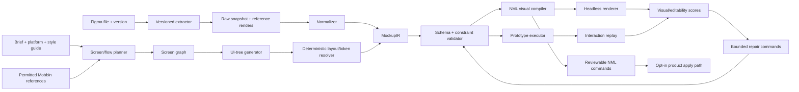

# Figma → interactive Nootles mockup pipeline

Status: step 1 implemented headlessly; steps 0 and 2–11 remain proposed. No corpus
collection, live Figma extraction, training, model, product schema, or runtime change has
been made. Prepared 2026-09-08 as the implementation companion to the
[Figma + Mobbin data plan](figma-mobbin-ai-training-plan.md); implementation status last
updated 2026-09-09.

## Assumption and outcome

Assume there are enough labeled, authorized Figma projects to train and evaluate the
system. Dataset acquisition, annotation staffing, and corpus sizing are outside this plan.

The target product behavior is:

> Given a product brief, platform, constraints, optional style guide, and optional design
> references, produce an editable multi-screen Nootles mockup and a runnable interaction
> graph. Let the user preview, test, and revise it before applying it through Nootles'
> normal review and command path.

The first release is a prototype generator, not a production-code generator. It must
create semantic, editable elements; a visually similar screenshot pasted onto the canvas
does not count as success.

## Current Nootles boundary

The headless NML v1 core and semantic command executor already provide stable IDs,
validated atomic batches, and per-shape/per-edge commands. They are the right future apply
boundary, but they are not mounted in the production editor yet.

The current canvas scene represents groups, rectangles, ellipses, polygons, text, images,
paths, and connectors. It has no typed concepts for screens, UI roles, hotspots, triggers,
navigation, overlays, variables, or prototype state. Arbitrary string attributes can
round-trip, but hiding behavior there would make it opaque to validation, commands, and
review.

Therefore:

1. Train and evaluate against a versioned, headless `MockupIR` first.
2. Compile the visual subset of `MockupIR` into the existing NML canvas scene.
3. Keep prototype behavior in a typed test sidecar until the interaction model and player
   pass their gates.
4. Only then propose a versioned NML canvas/prototype extension and production migration.
5. Never let a model write directly to Yjs, Convex, or a live canvas. Model output must
   become validated semantic commands and pass through preview/review.

The isolated [`app/lib/figma`](../app/lib/figma) library and
[`figma-extractor`](../figma-extractor/README.md) CLI implement step 1 only. They capture
raw Figma REST data and content-addressed reference renders; they do not invoke NML,
`MockupIR`, the editor, Yjs, Convex, a model, or any product route. The existing
[`figma-plugin`](../figma-plugin/README.md) remains a separate user-driven clipboard
converter and is not used by this dataset extractor.

## Initial scope

### P0: required

- Desktop-web and iOS-mobile screen frames at fixed reference viewports.
- Groups/auto layout, basic shapes, text, images, paths, clipping, order, common fills,
  borders, radius, shadow, and typography.
- Reusable component/instance identity and design-token references, even if the first NML
  compiler materializes them into ordinary editable shapes.
- Multi-screen flows with click/press triggers and navigate, back, open/close overlay,
  swap overlay, scroll-to, and change-variant actions.
- Deterministic dissolve and directional transitions; unsupported transitions remain
  explicit diagnostics.
- Brief-driven creation, whole-screen generation, and instruction-driven refinement.

### P1: after P0 passes

- Hover, drag, timeout, and keyboard triggers.
- Boolean/string/number variables, set-variable actions, and simple conditionals.
- Form-field state and validation states when the labeled project supplies semantics.
- Responsive variants at more than one viewport.
- Component-state preservation and a restricted smart-animate approximation.

### Deferred

- Production frontend code, backend behavior, live data, arbitrary vector/effect fidelity,
  video/audio runtime, full Figma expression semantics, and perfect smart animate.
- Unlabeled screenshot-to-layer reconstruction. Mobbin references may exercise the product
  workflow, but they are not a substitute for structured Figma ground truth.

Figma's REST representation exposes the document tree, components, component sets,
styles, optional path geometry, rendered references, and node prototype interactions.
Those interactions include triggers and actions such as navigation, overlays, scrolling,
variant changes, variable updates, and conditionals. Use supported APIs rather than a
proprietary `.fig` decoder.
[Figma file endpoints](https://developers.figma.com/docs/rest-api/file-endpoints/),
[node types](https://developers.figma.com/docs/rest-api/file-node-types/),
[interaction property types](https://developers.figma.com/docs/rest-api/file-property-types/)

## Proposed architecture

Keep training and runtime representations identical. Do not train a model to emit one
shape and maintain a separate handwritten production payload.

## Core contracts

`RawFigmaSnapshot` is an immutable capture of one file version: source IDs, node tree,
components/instances, styles/variables available to the integration, interactions,
asset references, and rendered reference images. Hash it and never silently refresh it.

`MockupIR` is provider-independent and contains:

- project metadata, platform, viewport profiles, and flow starting points;
- named tokens and reusable components/variants;
- screen records with stable IDs and ordered semantic nodes;
- each node's UI role, primitive, parent, component reference, text/asset, layout
  constraints, resolved bounds, style, clipping, state binding, and editability class;
- typed interactions with source node, trigger, ordered actions, destination/state
  references, transition, and optional condition;
- explicit unsupported/loss diagnostics and source-to-IR ID mappings.

`MockupCommand` is the only generative edit target: insert/update/move/remove screen,
component, node, interaction, token, or state. A batch is all-or-nothing, refers to stable
or temporary IDs, and is rejected for dangling targets, invalid types, or failed
preconditions.

`InteractionTrace` is an executable assertion: initial screen/state, ordered user events,
expected screen/overlay/state after each event, and a final screenshot or semantic state.

## Multi-step implementation plan

### Step 0 — Freeze the product contract and benchmark

Deliver a one-page P0 capability matrix, the four contracts above, a loss taxonomy, and
20–30 representative held-out project manifests. Freeze viewport, font, and renderer
versions. Define separate scores for deterministic Figma conversion and generative
creation.

Tests: schema examples, unsupported-feature examples, duplicate/dangling ID cases, and one
hand-authored interaction trace per supported action.

Exit gate: product/design/ML owners agree what “editable” and “interactive” mean; every
P0 feature has a measurable assertion and no feature is represented only by prose.

### Step 1 — Build the versioned Figma extractor

**Implemented headlessly on 2026-09-09.** `app/lib/figma` owns the versioned library;
`figma-extractor` provides the bundled Node CLI and operating notes. The contract requires
an exact version ID and adds it to file, selected-node, and render requests. The extractor
version plus normalized, sorted request options form the SHA-256 cache key; credentials
and retry policy do not.
The snapshot retains unknown response fields, inventories P0-bearing fields, reports
malformed nodes and missing dependencies/renders, and verifies both snapshot and artifact
hashes when reading cache entries.

Reference-render URLs are downloaded immediately and replaced by local content addresses
because Figma documents them as expiring. Current-file/caller-dependent root metadata and
signed URLs are omitted from the stable portion with every JSON pointer declared under
`volatile.omitted`. Cache and output writers accept only new or byte-identical files. The
CLI defaults to offline cache materialization; a live run additionally requires
`--allow-network` and an environment token. Bound variable aliases are preserved, but the
variable-definition endpoint is not called because it has no file-version parameter.

Implement a headless CLI/library around `GET /v1/files/:key` and selected-node/image
endpoints. Pin file version IDs; collect the document tree, component metadata, styles,
interactions, optional vector paths, image-fill references, and reference renders. Cache
by file/version/node/options hash and write a machine-readable extraction report.

Start entirely from recorded or fabricated responses. Any live Figma request is a
separately approved, bounded run under the workspace API-safety rule.

Tests: recorded-response contract tests, rate-limit/error handling, expired assets, null
render results, component dependencies, malformed nodes, and repeatable hash output.

Exit gate: two extractions of the same version are byte-stable apart from declared
volatile metadata, and no required P0 field is silently discarded.

Fixture gate: passed with fabricated recorded responses, including rotated signed URLs
with identical bytes. A live conformance capture remains a separately approved bounded
run; it is not necessary to weaken the static-first API-safety rule.

### Step 2 — Normalize Figma into `MockupIR`

Resolve transforms, bounds, auto-layout constraints, text spans, paints/effects, clips,
component ancestry/overrides, token aliases, frame flow starts, and prototype actions.
Preserve both authored constraints and resolved geometry. Normalize colors and dimensions
without erasing the source value. Convert unsupported features to typed loss records,
never raster fallback without a diagnostic.

Tests: golden file-to-IR fixtures, source-ID stability, transform/rotation math, nested
auto-layout, component overrides, token aliases, assets, every P0 trigger/action, and
property/fuzz tests for tree and graph invariants.

Exit gate: 100% schema validity, zero dangling references, exact text preservation, stable
IDs across repeat extraction, and a reviewed loss report for every held-out fixture.

### Step 3 — Build the deterministic visual compiler

Compile `MockupIR` screens and nodes into the current NML canvas subset. Prefer groups and
CSS auto layout over model-authored absolute coordinates where possible. Reuse source
paths/images only when authorized, retain component/token lineage in the compile manifest,
and count raster fallback separately from editable output.

Tests: `MockupIR → NML → parse/serialize` goldens, AST/Yjs/canvas equivalence, text and
asset fidelity, clipping/order/layout, stable source-to-NML ID maps, and determinism.

Exit gate: every generated scene validates, serializes deterministically, contains no
dangling edges, and can be edited through existing shape commands in an isolated fixture.

### Step 4 — Build the prototype executor and player

Implement a pure state machine over the interaction sidecar, then an isolated browser
player. Events dispatch typed actions; actions update navigation history, overlays,
variants, scroll, and state. The player must expose semantic state as well as pixels so
tests do not infer behavior from screenshots.

Tests: every trigger/action pair, back-stack and overlay nesting, invalid destinations,
temporary press states, cancellation, deterministic transitions, keyboard/focus
accessibility, and browser replay at desktop/mobile sizes.

Exit gate: all supported gold traces replay deterministically, unsupported actions fail
closed, and replay uses no backend or model calls.

### Step 5 — Build the offline evaluation harness

Run extraction, normalization, generation, compile, render, and replay as separately timed
stages. Save content-free diagnostics plus local artifacts: IR, NML, screenshots, traces,
losses, and scores. Compare by source project so derivative screens cannot leak across
train and test.

Score at least:

- contract validity, ID stability, dangling references, and compiler losses;
- exact text/content preservation and required-control recall;
- node kind/role accuracy, token/component reuse, and editable-element coverage;
- bounding-box error, alignment, spacing, clipping, overlap, and render distance;
- required screen reachability and full interaction-trace pass rate;
- accessibility tree, keyboard path, and target-size checks;
- p50/p95 generation, compile, render, and replay latency plus calls/tokens/cost;
- blind human preference and revision effort against the best baseline.

Exit gate: one command reproduces a model-free report on sealed fixtures with networking
blocked and identical semantic results across runs.

### Step 6 — Establish non-trained baselines

Implement three baselines before fine-tuning: deterministic template/layout assembly,
few-shot structured generation, and retrieval of a similar screen/flow followed by
constrained adaptation. All baselines emit `MockupCommand` batches, not raw NML or pixels.

Exit gate: a frozen report identifies whether the dominant failure is flow planning,
component selection, layout, visual styling, interaction wiring, or repair.

### Step 7 — Train the planner and interaction graph

Train a structured planner on `brief + platform + constraints → screen graph + interaction
graph + abstentions/questions`. Include explicit negative cases where the brief lacks
information required to invent a state or branch. Constrain decoding to the schema.

Tests: held-out product families, missing-information cases, flow reachability, required
path coverage, duplicate/unreachable screens, action-target validity, and comparison with
the best non-trained planner.

Exit gate: 100% parsed/validated plans and a material improvement in required-flow recall
or revision effort without worse unsupported-feature invention.

### Step 8 — Train the UI builder and editor

Train two related tasks rather than one monolith:

1. `screen graph + tokens/components + requirements → MockupIR node/layout commands`;
2. `current MockupIR + user critique → minimal MockupCommand patch`.

Use a curriculum: single screen, component reuse, multi-screen consistency, then
interaction-aware states. Have the model choose semantic layout constraints and token
references; let deterministic code solve final geometry. Weight interaction targets and
editable structure independently from screenshot similarity.

Exit gate: the builder beats the best baseline on the frozen benchmark and the editor
makes smaller successful patches than full regeneration, without reducing trace success.

### Step 9 — Add bounded validation and repair

Run schema checks, content/spec checks, layout constraints, accessibility checks, and
interaction replay before accepting a candidate. Permit at most a fixed number of repair
passes. Each repair is a typed diff with a reason; never feed raw source captions as
instructions. A candidate that still fails is rejected, not partially applied.

Exit gate: every promoted candidate validates, all required flows replay, failures remain
inspectable, and retry amplification is bounded in the evaluation report.

### Step 10 — Integrate behind Nootles review

Only after the headless gates pass, design the versioned NML prototype extension and its
semantic commands. Integrate through the canonical NML runtime-adoption sequence, not the
legacy canvas HTML mirror. Preview proposed screens/interactions, support per-screen or
per-hunk acceptance, attribute the transaction, checkpoint before apply, and log outcome.

Static/unit tests come first. Browser verification must run with AI keys unset until an
operator approves an exact paid call budget.

Exit gate: an opt-in local fixture can generate, preview, interact, accept/reject, undo,
and reload without bypassing authorization, review, history, or persistence contracts.

### Step 11 — Run the controlled pilot and promote conditionally

Start with the three projects below as sealed, never-trained-on system tests. Compare the
deterministic conversion ceiling, the best baseline, and trained output from the same
brief/style constraints. Record first-pass success, interaction completion, human edits,
time to acceptable mockup, and post-acceptance reversal.

Provisional promotion gates:

- 100% schema validity and zero dangling IDs/actions for anything shown to a user;
- 100% exact preservation of required supplied text, values, and destinations;
- at least 95% pass rate on P0 required interaction traces overall, with every critical
  path passing;
- at least 95% of required supported elements editable rather than raster fallback;
- no regression in accessibility or content/spec checks against the baseline;
- either at least a 10-point blind-preference improvement, or comparable quality with at
  least 30% less measured revision time, serving cost, or p95 latency.

Thresholds are proposed starting points. Expand the sealed benchmark before claiming
rare-error safety.

## Three Mobbin projects for early testing

Mobbin supplies app screens and multi-step flows; it does not supply verified structured
Figma projects. “Copy to Figma” may create raster reference frames. For each candidate,
create a separate pilot Figma file with these pages:

1. `00 Reference` — locked Mobbin references and source links;
2. `10 Gold reconstruction` — reviewed editable layers, auto layout, components, tokens,
   prototype links, and trace labels;
3. `20 Model output` — generated candidates only;
4. `90 Evaluation` — overlays/diffs and reviewer notes.

Keep all three projects sealed from training.

| Pilot project | Suggested flow | Why it is useful | Minimum interaction assertions |
|---|---|---|---|
| [Airbnb Web](https://mobbin.com/apps/airbnb-web-4ae8db3a-677a-40c0-bc7b-c5617045ab76) | Search → date/guest selection → results/filter → listing → reserve | Dense responsive web layout, repeated cards, imagery, sticky regions, popovers/modals, and checkout handoff | Open/close search and filter overlays; update visible search state; navigate results → listing → reserve; preserve scroll where declared |
| [Revolut iOS](https://mobbin.com/apps/revolut-ios-28b2d970-a05d-4509-99dd-83d47dbc3a16) | Account-opening/onboarding → identity details → verification choice → completion/error | Mobile forms, progress, permissions/trust copy, conditional branches, system-like inputs, and success/error states | Advance/back with state preserved; validation blocks incomplete input; branch by verification choice; completion and recoverable error are reachable |
| [Transit iOS](https://mobbin.com/apps/transit-ios-31a9515e-f215-4553-b159-4184a0b908c0) | Location permission → destination search → route alternatives → trip detail/service alert | Map/list composition, bottom sheets, dynamic route cards, geolocation states, overlays, and spatially dense content | Permission branch; open/drag/close bottom sheet; choose a route; open alert overlay; back returns to the prior route-list state |

These are deliberately different: Airbnb stresses desktop composition, Revolut stresses
form/state logic, and Transit stresses spatial UI and layered interaction.

Mobbin's official MCP can search screens and multi-step flows, but its Terms effective
May 16, 2026 restrict using Platform content to train, test, benchmark, or improve AI unless
the Terms or written consent expressly permit the use. Treat the links above as a selected
shortlist only. Before copying screens into the pilot files or using them in evaluation,
confirm that the operator's Mobbin agreement and third-party rights cover the exact
internal benchmarking, derivative-file, retention, and model-input uses. Otherwise replace
them with owned flows that exercise the same capability matrix.
[Mobbin MCP features](https://docs.mobbin.com/mcp/features),
[Mobbin Terms, clauses 3.4–3.5](https://mobbin.com/terms)

No Mobbin screen assets were downloaded or copied while preparing this plan.

## Suggested delivery sequence

With one product engineer and one ML engineer working in parallel, use three gated tracks:

| Track | Steps | Planning estimate | Result |
|---|---|---|---|
| Headless foundation | 0–5 | 5–7 weeks | Extractor, IR, compiler, player, and reproducible evaluator |
| Model experiments | 6–9 | 4–7 weeks after the first evaluator gate | Baselines, planner, builder/editor, and bounded repair |
| Product adoption | 10–11 | 3–5 weeks after model promotion | Versioned prototype semantics, reviewed apply path, and opt-in pilot |

The estimates exclude dataset work, legal/permission lead time, model-job queue time, and
any broader NML production migration. Do not start product adoption merely because a
training job completed; the headless gates are the dependency.

## Definition of done

The pipeline is ready for an opt-in product pilot when a fresh authorized Figma project can
be extracted into stable `MockupIR`, compiled into editable NML visuals, replayed through
typed interactions, regenerated/refined from a brief through validated commands, and
evaluated reproducibly against sealed projects. No model output reaches persistent Nootles
state without the existing authorization, review, attribution, checkpoint, and apply
boundaries.
