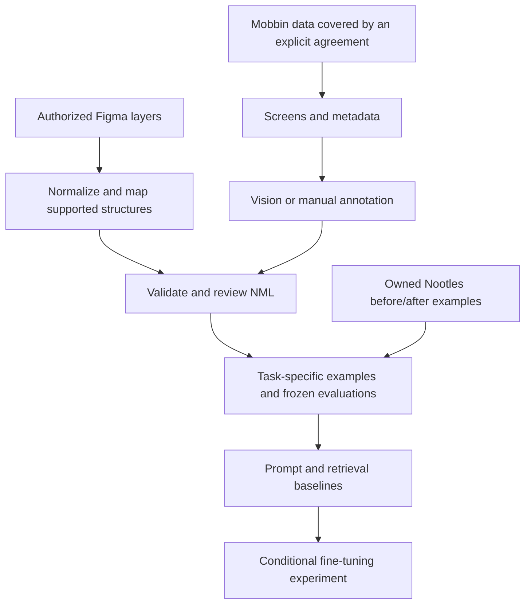

# Figma + Mobbin data for Nootles AI

Status: data/training proposal; no corpus collection, training, or runtime change has been
made. The companion mockup-pipeline plan's versioned Figma extractor is implemented as an
isolated headless tool. Prepared 2026-09-06 for
[NT-11](https://linear.app/nootles/issue/NT-11/map-out-figma-mobbin-data-collection-and-fine-tuning).

## Recommendation

Build a small, reviewed corpus of **Nootles tasks and correct outcomes**, using owned or
appropriately licensed designs as supporting material. Start with block-format suggestions
and canvas layout as separate tasks. Establish the existing prompt baseline, compare it
with retrieval of relevant examples, and fine-tune only where measured failures justify it.

For block formatting, the best first implementation is a constrained suggestion pipeline:
choose an appropriate format or abstain, produce a content-preserving transformation,
validate it, and use the existing review flow. The best initial fine-tuning experiment is
supervised training of a small text model on reviewed before/after examples, including
no-change cases. A classifier/ranker may suffice if choosing the format is the bottleneck;
train a generator only if generating the transformation is also failing.

For canvas layout, start with reusable NML patterns, retrieval, and deterministic layout
rules. Figma's structured layers are useful here. A screenshot-to-NML vision model is a
later, separate experiment with substantially more annotation and verification work.

Do not make Mobbin scraping the critical path. Its current terms explicitly restrict
training, testing, indexing, and benchmarking AI with its content unless permitted by the
terms or written consent. Treat a data agreement as a prerequisite for the proposed Mobbin
corpus, including descriptions and derived examples. Retrieval is not automatically an
exception. [Mobbin terms, clauses 3.4–3.5](https://mobbin.com/terms)

## What NT-11 and related material establish

NT-11 asks for two solutions: Figma → NML, and Mobbin collection → Figma → NML plus
Mobbin descriptions. The issue currently has no comments, attached documents, or linked
dependencies. Searches of accessible Linear issues for NML, Mobbin, and suggestions found
the related architecture work below; Linear document and project listings returned empty.
No separate existing Figma/Mobbin training plan was found in the local docs/wiki search.
This search does not establish that none exists in unconnected drives or design files.

| Source | Implication for this plan |
|---|---|
| [NT-5: Plan NML as source of truth](https://linear.app/nootles/issue/NT-5/plan-nml-as-source-of-truth) | Architecture work is marked Done; use its documented model rather than inventing another output language. |
| [NT-8: Build the headless NML core](https://linear.app/nootles/issue/NT-8/build-the-headless-nml-core) | In Progress at review time; production integration must not assume the refactor is complete. |
| [Canonical NML AST](nml-canonical-ast.md) and [foundational decisions](nml-foundational-decisions.md) | Define schema versions, identity, supported structures, round trips, and bounded nesting. |
| [Refactor plan](nml-prosemirror-refactor-plan.md) and [ProseMirror View Bridge](nml-prosemirror-view-bridge.md) | Separate headless dataset tooling from future editor adoption. |
| [AI system wiki](../../agent-wiki/architecture/ai-system.md) and [editor/sync wiki](../../agent-wiki/architecture/editor-and-sync.md) | Keep validation, review, attribution, history, and current canvas persistence contracts. |
| [Current reformat implementation](../app/lib/ai/reformat.ts) | Already uses few-shot instruction prompting, returns up to three `{label, html}` candidates, preserves the first block ID, and uses `[]` for abstention. |
| [AI configuration](../app/lib/ai/aiConfig.ts) and [reformat route](../app/api/reformat/route.ts) | Existing lane and usage recording provide the comparison point; old comments about model measurements are not a fresh benchmark. |

The headless AST/parser/serializer/Yjs foundation exists; the live editor still uses its
current BlockNote/ProseMirror and canvas paths. Local in-progress command-core changes
were present during research and are not treated as a deployed contract. Dataset generation
can use a pinned headless core without waiting for the complete editor migration.

## Potential use cases

Priority is a proposed sequence, not an approved roadmap.

| Priority / process | Example input → desired output | Most useful data | Best initial method / success measure |
|---|---|---|---|
| P0: block-format choice | Repeated owner/task facts → table; unrelated prose → no suggestion | Nootles notes with human format decisions; explicit negative cases | Rules + prompt baseline, then classifier/ranker or SFT; useful suggestions at low false-positive rate |
| P0: block transformation | Several paragraphs containing source code → one code block | Reviewed before/after blocks with exact content and IDs | Few-shot/retrieval + constrained output; preservation and valid application |
| P1: canvas organization | Existing nodes/edges → aligned, legible arrangement | Owned Figma/FigJam diagrams and Nootles before/after scenes | Deterministic layout + pattern retrieval; fewer overlaps, correct topology, user preference |
| P1: brief-to-diagram | User-supplied process → editable flow with appropriate grouping | Brief/scene pairs, including missing-information cases | Retrieved templates + existing model; factual and topology fidelity |
| P1: contextual next structure | Existing plan → useful next section or canvas skeleton | Real planning tasks and owner-reviewed continuations | Retrieval first; separate from reformat because it can introduce content |
| P2: screen/flow-to-planning artifact | Authorized screen sequence → storyboard or flow diagram | Screenshots, sequence metadata, reviewed captions and NML | Vision-assisted extraction + human correction; faithful sequence and editable output |
| P2: screenshot-to-editable canvas | Authorized reference → supported Nootles scene | Image/NML pairs with verified labels and geometry | Vision baseline, then multimodal SFT if needed; editability as well as visual similarity |
| P2: suggestion ranking/personalization | Several valid formats → preferred option or abstention | Explicit comparisons, accepted edits, later reversals | Ranker first; preference optimization later; sustained usefulness per user |

A polished app screen is not a label for how a planning note should be formatted. Figma
and Mobbin can supply layout examples; task intent and a correct Nootles response still
need annotation. They are weak sources for code/math formatting and general planning
prose. Use purpose-built Nootles examples for those categories.

## Acquisition and conversion

### Figma → NML

Prefer a selected-frame exporter for a small owned corpus, followed by REST ingestion for
approved files if scale warrants it. The Plugin API exposes frame structure; REST node
data includes layout and visual properties. Neither implies a ready-made Nootles semantic
mapping. [Figma FrameNode](https://developers.figma.com/docs/plugins/api/FrameNode/),
[REST node types](https://developers.figma.com/docs/rest-api/file-node-types/)

The companion plan's
[step-1 extractor](figma-interactive-mockup-pipeline-plan.md#step-1--build-the-versioned-figma-extractor)
now supplies the REST-ingestion capture boundary: exact version pinning, raw file and
selected-node payloads, optional geometry, content-addressed reference renders, immutable
cache/output, and a machine-readable coverage/diagnostic report. It deliberately stops
before semantic normalization or Figma→NML conversion. No live source or corpus was used
to build or test it.

Proposed steps:

1. Record provenance, file/node/version, permitted uses, and the intended task before export.
2. Export selected layer trees and a reference render; gather relevant text, geometry,
   ordering, styles, components, and layout constraints. Keep originals versioned.
3. Normalize into an intermediate design record that distinguishes source properties from
   inferred meaning. Resolve coordinates and component appearance; preserve source IDs in
   a mapping manifest rather than reusing them as production Nootles IDs.
4. Convert the supported subset deterministically. Infer semantic blocks only where task
   context supports the interpretation; send ambiguous items for review.
5. Validate against the pinned NML/domain schemas, serialize canonically, and render using
   Nootles' renderer. Review text, grouping, topology, and appearance against the reference.
6. Record unsupported features, approximations, and reviewer corrections. Admit only
   reviewed outputs to the gold dataset; preserve losses as explicit diagnostics.

| Figma material | Proposed Nootles mapping | Boundary |
|---|---|---|
| Text layers | Canvas labels by default; prose/headings when meaning is established | Font size alone does not establish a document heading. |
| Rectangles, ellipses, connectors | Supported canvas shapes/edges | Use actual canvas schema capabilities; arbitrary vectors are not guaranteed. |
| Frames/groups/auto layout | Supported grouping and layout or resolved geometry | Do not import arbitrary Figma nesting as nested Nootles blocks. |
| Repeated records | Table/list only after semantic review | A grid of cards is not necessarily tabular data. |
| Images and complex effects | Authorized image asset fallback | Mark raster fallback as non-editable; exclude it from editable-shape success counts. |
| Prototype links | Flow edges when explicit source metadata supports them | A still screen does not reveal interactions or backend behavior. |

For subsequent REST batches, cache approved versioned exports, deduplicate requests, obey
429 retry instructions, and budget for plan/seat-dependent limits. Avoid a proprietary
`.fig` decoder for the pilot; Figma recommends supported APIs for third-party tools.
[Rate limits](https://developers.figma.com/docs/rest-api/rate-limits/),
[local-file documentation](https://help.figma.com/hc/en-us/articles/8403626871063-Save-a-local-copy-of-files)

API access and content rights are separate checks. Review the intended collection under
Figma's Developer Terms and the applicable content license/customer agreement. Public
Community access is not evidence of permission for this training use. The Developer Terms
also address integration permissions and bidirectional data flow; confirm how these apply
before turning an internal exporter into a distributed integration.
[Figma Developer Terms](https://www.figma.com/legal/developer-terms/)

### Mobbin → NML, with Figma optional

Do not assume “Copy to Figma” provides editable component trees. Mobbin documents a screen
copy workflow, but that is insufficient evidence of semantic layers. The primary plugin
listing could not be fetched during this review; verify one permitted export manually
before accepting editable output as a dependency.
[Mobbin changelog](https://mobbin.collaboo.co/changelog)

Design the default pipeline for screenshots and metadata:



If a Mobbin export is a raster image, routing it through Figma does not recover its layer
tree. Use Figma only as an annotation/reconstruction workspace when useful. After rights
are established, compare manual reconstruction with vision-assisted extraction into the
same intermediate record. Label OCR, inferred component roles, and reconstructed geometry
as inferred, not source truth. Keep Mobbin-provided descriptions separate from generated
captions; missing descriptions remain missing until reviewed.

The collection options, in order, are a licensed bulk export/partnership, an authorized
API workflow if its agreement covers this purpose, and a small permitted manual sample.
Build an automated scraper only if expressly covered, with documented fields, volume,
retention, rate limits, and restart/deduplication behavior. An API/MCP subscription alone
does not settle dataset or model-training rights. Confirm rights to third-party screen
content as well as Mobbin's service/content permissions before collecting.

## Methods and which to choose

These are architectural recommendations, not measured winners for Nootles.

| Method | What it improves | Tradeoff | Recommendation |
|---|---|---|---|
| Deterministic rules/templates | Known conversions, grammar, geometry constraints | Limited semantic judgment | Always use for validation and straightforward layout/conversion. |
| Prompting with curated examples | Behavior on a small task set | Prompt length and model variability | Required baseline; current reformat already does this. |
| Retrieval-augmented generation (RAG) | Supplies relevant examples/patterns at inference time without changing weights | Retrieval latency, context cost, retrieval mistakes | Best next experiment; begin with task tags/text search over a small corpus before embeddings. |
| Classifier or candidate ranker | Chooses format, ranks valid candidates, learns abstention | Does not generate transformed content | Best cheap specialization if selection is the primary failure. |
| Supervised fine-tuning (SFT) | Repeated input → desired output behavior | Requires consistent task labels and retraining on contract changes | Best first generative fine-tune; narrow text task before vision. |
| LoRA/QLoRA adapter training | Makes open-weight SFT more practical on limited hardware | Hosting, base-model license, hardware and maintenance burden | Choose if deployment economics justify self-hosting; not a separate learning objective. |
| Multimodal SFT | Image + request → structured scene | Expensive curation; screenshot ambiguity; image processing overhead | Later, only for demonstrated screenshot-to-NML demand. |
| Distillation | Teaches a smaller model from reviewed stronger-model outputs | Teacher costs and inherited errors | Useful way to build SFT examples after a teacher baseline proves quality. |
| Preference optimization (e.g. DPO) | Preference among plausible outputs | Needs reliable same-context chosen/rejected pairs | Later, once correctness is strong and explicit comparisons exist. |
| Continued pretraining/full model training | Broad distribution or language adaptation | High cost; raw screens do not teach task intent | Do not start here. |

SFT can train text or vision-language tasks; DPO consumes preference examples. LoRA freezes
base weights and trains a smaller adaptation. These distinctions explain why “fine-tuning”
is not a single pipeline choice. [SFT documentation](https://huggingface.co/docs/trl/en/sft_trainer),
[DPO documentation](https://huggingface.co/docs/trl/en/dpo_trainer),
[LoRA paper](https://arxiv.org/abs/2106.09685)

For a first SFT run, prefer managed training if a candidate supports the required output
contract, acceptable data handling, and deployment economics. Compare an open-weight
adapter only when there is a concrete hosting/privacy/cost benefit. Pick the base model
through the frozen evaluation, not its general leaderboard score. Provider/model support
and pricing must be checked when a run is proposed; this plan does not select a paid endpoint.

## Dataset design

Maintain three linked assets: authorized source material, reviewed canonical NML artifacts,
and task examples. Store originals in controlled artifact storage, not the source repo;
keep manifests and fabricated fixtures in version control. This proposes no Convex schema.

Each example should record:

- Stable example ID, source family, source version/hash, rights/consent reference and allowed
  uses (retrieval, evaluation, training), retention/deletion obligations, and split group.
- Task type, user instruction, input blocks/scene, relevant context available at inference,
  allowed formats, source-ID mapping, and schema/serializer/output-contract versions.
- Desired decision or abstention, reviewed output, covered source blocks, content invariants,
  unsupported/loss diagnostics, reviewer status, and optional same-context preference pair.
- Whether labels came from a human, deterministic conversion, or a named/versioned teacher;
  inferred captions never become unmarked ground truth.

For reformat, preserve the current `{label, html}[]` contract in the initial runtime-facing
dataset. Store canonical before/after NML separately for validation and future conversion.
Do not mix canonical `<nt-document>` envelopes, legacy fragments, and proposed semantic
commands as interchangeable training targets. Pin the adapter used for each dataset release.

Example annotation, deliberately not a new runtime payload:

```json
{
  "task": "block_format_choice",
  "input": "Buy milk, call the bank, book the flight",
  "acceptable_formats": ["checklist", "bullet_list"],
  "preferred_format": "checklist",
  "preserve": ["Buy milk", "call the bank", "book the flight"],
  "forbidden_changes": ["invent deadlines", "invent priorities"],
  "origin": "human_authored_fixture"
}
```

Suggested pilot: 300 independently reviewed cases: 180 training/example-library cases,
60 development cases, and 60 sealed test cases. Include roughly one-third abstentions as
a starting coverage choice, then evaluate at realistic traffic prevalence. Cover prose,
lists, tables, code, math, diagrams, ambiguous cases, and partial multi-block consumption.
Keep multiple acceptable answers where appropriate. This is a feasibility sample, not a
claim that 300 examples is sufficient for production fine-tuning.

Split by source app/file/template/project **before** making crops, variants, rewrites, or
teacher examples. Keep all derivatives in the same split and deduplicate across sources.
The retrieval library must also exclude development/test answers and their close relatives.
Include a separate held-out Nootles task set to measure whether design examples transfer
beyond polished UI screens. Expand toward 1,000–3,000 reviewed examples only if learning
curves and error analysis justify the annotation effort.

Accepted suggestions are useful weak evidence, not automatic gold labels. Rejection can
mean bad timing; survival can mean the user never revisited the page. Before using product
logs, inventory what is actually retained, establish training consent for all relevant
content, and capture explicit comparisons where needed. Deletion must reach source files,
indexes, derivatives, and future training sets; model retraining/retirement obligations need
an explicit policy because removing a row does not remove its influence from weights.

## Evaluation and production boundary

Compare on the same frozen inputs: current prompt, revised prompt, retrieval-assisted
prompt, classifier/ranker if applicable, and SFT. Keep generation settings and available
context comparable, report per-task results and uncertainty, and record all failures,
including upstream errors. Abstention and provider failure are different outcomes.

| Dimension | Measurement / proposed gate |
|---|---|
| Format usefulness | Blind owner/reviewer preference with ties; format accuracy against the acceptable set |
| Abstention | Precision among shown suggestions, false suggestions on no-change cases, and coverage; initial target ≥95% shown precision and ≤5% false suggestions |
| Preservation | No lost facts, altered numbers, invented relationships, or unintended block deletion in the release set; inspect meaning as well as token overlap |
| Structural validity | Raw parse/schema success plus post-validation success; 100% of applied candidates must validate; report rejects/repairs rather than hiding them |
| Identity and application | Preserve existing IDs, resolve inserted IDs correctly, verify covered blocks, conflicts, rollback, and review behavior |
| Canvas quality | Text/topology fidelity, overlap/clipping, grouping, editable-element coverage, and blind visual preference |
| Generalization | Unseen source families and real Nootles tasks; report negative transfer by category |
| Operations | p50/p95 end-to-end latency, tokens/calls, and cost per useful accepted suggestion, including retrieval, retries, and validation |

Provisional promotion rule: a fine-tune must satisfy the safety/precision gates and either
improve blind usefulness by at least 10 percentage points over the best prompt/retrieval
baseline, or deliver comparable quality with at least 30% lower measured serving cost or
p95 latency. These are proposed business thresholds, not empirical findings. A 60-case test
set cannot certify rare-error safety; expand evaluation and report uncertainty before rollout.

The current word-overlap helper is not proof of semantic preservation: negation, repeated
values, and entity relationships need dedicated checks. Visual similarity alone can reward
a flat screenshot, so editable scene correctness must be scored separately.

Future serving flow: existing context collection → optional retrieval/format selection →
candidate generation → schema/content validation → existing preview/review/apply flow →
outcome recording. Treat source text and captions as untrusted data, never instructions.
Preserve entitlements, attribution, cancellation, checkpoints, and usage recording. Do not
write directly from a model into Yjs/Convex or bypass the current diagram mirror. Switch
to canonical semantic commands only when their runtime integration is independently ready.

## Proposed work packages and decision gates

| Step | Deliverable | Exit decision |
|---|---|---|
| 1. Scope and rights | Confirm P0 task definition; source inventory; Mobbin agreement questions; Figma use review | Can each source be used for each proposed purpose? If Mobbin is unresolved, proceed with owned Nootles fixtures. |
| 2. Static pilot | Annotation rubric; 300 cases; frozen splits; small owned Figma conversion feasibility sample (about 20 varied frames) | Are target structures representable, and is review effort sustainable? |
| 3. Baseline comparison | Bounded, explicitly approved prompt/retrieval evaluation with error and cost report | Is the bottleneck selection, generation, missing context, or conversion? |
| 4. Narrow training experiment | One selected SFT or ranker experiment; versioned dataset/model report | Does it beat the best baseline under the promotion rule? |
| 5. Controlled product trial | Small opt-in cohort, existing review flow, feature flag and rollback | Does offline improvement survive real use without higher reversal or nuisance rates? |
| 6. Optional vision expansion | Licensed screenshot pairs and reconstruction benchmark | Does screenshot ingestion create enough value to pay for rights and annotation? |

Planning estimates, to revise after the static sample: 300 cases at 3–8 review minutes
each imply 15–40 annotation hours, excluding second review and tooling. Measure actual
conversion and review time per accepted Figma frame before committing to corpus size.
Mobbin licensing cost and lead time are unknown.

Compute budget should be derived from measured input/output/image tokens, number of
candidates, passes, and retries. Total cost includes licensing, annotation, teacher calls,
training, evaluation, hosting, and refreshes. Compare total cost per useful suggestion;
lower inference token cost alone does not establish a fine-tune's payback.

Every paid extraction, embedding, teacher, training, or evaluation run needs separate
operator approval naming the endpoint/job, maximum calls or jobs, and spending cap. This
planning task made no paid provider calls and did not download a design corpus.

## Open questions and proposed answers

| Question | My proposed answer | What remains to resolve |
|---|---|---|
| What does “block format suggestion” mean? | Choosing and applying a better structure to existing content, including doing nothing; continuation is separate. | Confirm whether ambient timing, explicit reformat, or both are in P0. |
| Is fine-tuning the objective? | Product improvement is the objective; SFT is a conditional means. | Agree that a successful retrieval/ranker solution can close the initial experiment. |
| Which source should come first? | Owned Nootles examples for formatting; owned/approved structured Figma for canvas. | Identify actual files and the person who can approve their use. |
| Can we use Mobbin now? | Do not admit it to the dataset until permissions cover the precise uses. | Operator/legal owner to resolve export, derivatives, training, eval, indexing, third-party content, and retention terms. |
| Must Mobbin pass through Figma? | No; only if it materially helps reconstruction or annotation. | Inspect one permitted export; confirm whether it contains images or real layers. |
| Can descriptions supervise NML generation? | They are input context; pair them with reviewed NML and explicit tasks. | Measure completeness, correctness, and rights for actual descriptions. |
| Is perfect Figma fidelity necessary? | No for planning tasks; define a supported semantic subset and record losses. | Agree which shape/layout features are valuable enough to support. |
| Train on screenshots or structured data? | Structured NML plus task inputs first; images only for a vision task. | Measure how often image-only inputs are actually needed. |
| Can we train on suggestions/logs? | Only with appropriate consent and reviewed labels; no automatic promotion of accepted edits. | Inventory retained fields and decide collection/retention/deletion policy. |
| Which model and training stack? | Small text model first; managed SFT for pilot simplicity if suitable, open-weight adapter if justified. | Frozen benchmark, current provider capabilities, rights, latency and total cost. |
| Wait for NT-8? | No for isolated dataset/validation work; yes for any dependency on unshipped command execution. | Pin a core version and separately confirm production integration readiness. |
| Who decides quality? | The product owner provides the initial gold judgments, consistent with the current daily-driver product goal. | Name annotation and engineering owners; second-review ambiguous and high-impact cases. |

## Definition of done for the planning phase

This document supplies the use-case shortlist, collection/conversion options, recommended
method sequence, data contract, evaluation gates, dependencies, and unresolved decisions
requested by NT-11. It does not claim a scraper, Figma→NML converter, dataset, or
fine-tuned model exists. The isolated versioned extractor described above is the only
implemented data-pipeline stage. The next concrete action is the source inventory and
static annotation/conversion pilot, followed by a separately budgeted experiment proposal.
