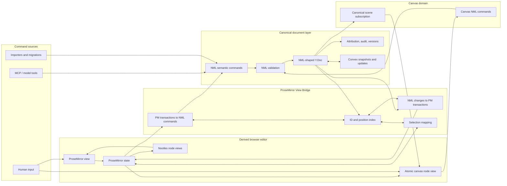

# NML ProseMirror View Bridge

Status: proposed architecture; not implemented.

The **ProseMirror View Bridge** (PVB) presents a canonical NML-shaped Yjs document through
ProseMirror without making ProseMirror state canonical. ProseMirror supplies mature browser
editing behavior—selection, input, IME, clipboard, tables, accessibility, and transaction
mapping—while NML remains the only persisted semantic document model.

“View Bridge” is deliberate: this is not a general two-master synchronization layer.
NML/Yjs is the sole source of truth. ProseMirror is an incrementally maintained editable
projection.

## High-level relationship



The canvas block and its complete scene are canonical NML/Yjs data. ProseMirror represents
the block as one atomic node; its node view subscribes directly to the scene beneath that
block. Shape and edge edits bypass ProseMirror while remaining canonical NML commands.

## Design principles

1. **One source of truth.** The NML Y.Doc is authoritative. ProseMirror never persists its
   JSON or Yjs layout as a second document.
2. **One command language.** MCP, slash commands, menus, and translated ProseMirror input
   converge on NML semantic commands.
3. **Stable identity before positions.** NML node IDs are durable; ProseMirror integer
   positions are ephemeral view coordinates.
4. **Incremental projection.** Remote changes become the smallest correct ProseMirror
   transaction, not a full editor rebuild.
5. **No echo loops.** A change translated from one side is recognized on the other and
   never translated back as a new edit.
6. **Preserve local interaction.** Remote updates must map selection, composition, scroll,
   stored marks, and plugin state rather than reset them.
7. **Deterministic normalization.** NML validation owns semantic normalization. The bridge
   must not allow ProseMirror normalization to become an undocumented second schema.
8. **Fail closed, recover content.** An untranslatable change makes the affected view
   read-only and reports diagnostics; it never silently drops content.
9. **Headless canonical core.** The NML schema, commands, validation, and Yjs encoding have
   no DOM dependency. Only the ProseMirror view side is browser-specific.
10. **Measured compatibility.** Every supported NML construct has explicit bidirectional
    fixtures; “renders approximately” is insufficient.
11. **Atomic domain projection.** A canonical custom domain may project as one ProseMirror
    node. ProseMirror does not need to represent or transact over its internal AST nodes.

## Responsibilities

The bridge owns:

- NML AST/Yjs node to ProseMirror node conversion.
- ProseMirror transaction to NML semantic-command conversion.
- Incremental node-ID and offset/position indexes.
- Local and remote selection mapping.
- transaction-origin suppression and acknowledgements.
- composition buffering and reconciliation.
- bridge diagnostics and safe degraded states.

The bridge does not own:

- authorization,
- persistence,
- the canonical NML schema,
- semantic command validation,
- audit/history policy,
- model tool definitions,
- visual node rendering,
- canvas rendering, geometry, and gesture semantics. Those belong to the canvas engine,
  while the bridge owns the atomic block boundary and lifecycle.

## Component boundaries

```text
@nootles/nml-core
  AST, schemas, normalization, serialization, semantic commands

@nootles/nml-yjs
  canonical shared-type encoding, transactions, relative positions

@nootles/prosemirror-view-bridge
  PM schema adapter, indexes, translation, selection, composition

@nootles/editor-web
  ProseMirror view, node views, menus, keyboard UI, accessibility
```

These names describe boundaries, not a required package split during the first
implementation.

## Input shapes

### Bridge construction

```ts
type CreateBridgeInput = {
  document: NmlYDocument;
  pmSchema: ProseMirrorSchema;
  nodeAdapters: NodeAdapterRegistry;
  actor: ViewActor;
  awareness?: AwarenessAdapter;
  diagnostics: DiagnosticSink;
  policy: BridgePolicy;
};

type ViewActor = {
  userId: string;
  clientInstanceId: string;
  displayName: string;
  color: string;
};

type BridgePolicy = {
  unsupportedNode: "readOnlyNode" | "readOnlyDocument";
  compositionConflict: "bufferRemote" | "cancelComposition";
  normalization: "nmlOnly";
};
```

### Canonical change input

```ts
type NmlChangeSet = {
  transactionId: string;
  origin: NmlTransactionOrigin;
  beforeStateVector: Uint8Array;
  afterStateVector: Uint8Array;
  changes: NmlChange[];
};

type NmlChange =
  | { kind: "text"; nodeId: string; delta: TextDelta[] }
  | { kind: "props"; nodeId: string; keys: string[] }
  | { kind: "insert"; parentId: string | null; nodeIds: string[] }
  | { kind: "remove"; parentId: string | null; nodeIds: string[] }
  | { kind: "move"; nodeId: string; from: NmlLocation; to: NmlLocation }
  | { kind: "replaceDomain"; nodeId: string; domain: string };
```

The Yjs adapter should produce semantic change sets while observing transactions so the
bridge does not infer everything from before/after full trees.

### ProseMirror transaction input

```ts
type PmTransactionInput = {
  transaction: Transaction;
  stateBefore: EditorState;
  stateAfter: EditorState;
  viewContext: {
    composing: boolean;
    inputType?: string;
    paste?: boolean;
    drop?: boolean;
  };
};
```

## Output shapes

### NML to ProseMirror

```ts
type PmProjectionResult = {
  transaction: Transaction | null;
  mappedSelection: Selection;
  changedNodeIds: string[];
  diagnostics: BridgeDiagnostic[];
};
```

`null` means the canonical change affects metadata or a domain rendered outside the
ProseMirror document and no PM transaction is needed. In particular, an internal canvas
shape or edge change returns `null`; the canvas node view observes the canonical scene
directly.

### ProseMirror to NML

```ts
type NmlCommandResult = {
  commands: NmlCommand[];
  selectionIntent: NmlSelection;
  grouping: {
    undoGroupId: string;
    closeGroup: boolean;
  };
  diagnostics: BridgeDiagnostic[];
};
```

The bridge returns commands; the canonical executor validates and commits them. It never
returns raw Yjs mutations.

### Bridge API

```ts
interface ProseMirrorViewBridge {
  initialState(config?: EditorStateConfig): EditorState;
  applyProseMirrorTransaction(input: PmTransactionInput): Promise<BridgeCommitResult>;
  applyNmlChangeSet(change: NmlChangeSet): PmProjectionResult;
  toNmlSelection(selection: Selection): NmlSelection;
  toPmSelection(selection: NmlSelection): Selection;
  status(): BridgeStatus;
  destroy(): void;
}
```

## Node adapter contract

Every NML block type registers exactly one adapter:

```ts
interface NodeAdapter<N extends NmlBlock = NmlBlock> {
  nmlType: N["type"];
  pmNodeType: string;

  toPmNode(node: N, context: ProjectionContext): ProseMirrorNode;
  fromPmNode(node: ProseMirrorNode, context: TranslationContext): NmlNodeDraft;

  translatePmStep?(step: Step, context: StepContext): NmlCommand[] | null;
  translateNmlChange?(change: NmlChange, context: ChangeContext): Transaction | null;

  validateProjection(nml: N, pm: ProseMirrorNode): BridgeDiagnostic[];

  domainView?: {
    mount(nodeId: string, host: HTMLElement, context: DomainViewContext): DomainView;
  };
}
```

Rules:

- IDs are stored in a required ProseMirror node attribute but are assigned only by NML.
- A ProseMirror split proposes a new NML node with a temporary ID; the canonical executor
  mints the durable ID, and the acknowledgement patches the projection.
- Node views may render React/DOM components but cannot mutate canonical state except by
  dispatching a semantic command.
- Unsupported NML nodes project as atomic, selectable, read-only placeholders preserving
  their ID and canonical serialized content.
- Adapters must be deterministic and pure except for explicit context services.
- The canvas adapter projects only block identity and block-level presentation metadata
  into ProseMirror. Its `domainView` subscribes to `canvas.scene` in the canonical Y.Doc.
- A domain view dispatches semantic NML commands; it cannot write shared types directly.

## Position and identity index

The bridge maintains both directions incrementally:

```ts
type NodePositionEntry = {
  nodeId: string;
  pmStart: number;
  pmEnd: number;
  contentStart?: number;
  parentId: string | null;
  path: number[];
};

type PositionIndex = {
  byId: Map<string, NodePositionEntry>;
  nodeAt(position: number): NodePositionEntry | null;
};
```

Requirements:

- Recompute only affected subtrees after a transaction.
- Never persist ProseMirror positions.
- Translate text offsets through the inline adapter, not by assuming PM offsets equal
  UTF-16 NML offsets.
- Represent durable NML selections using node IDs plus Yjs relative text positions.
- Detect a mismatched index before translating a mutation and rebuild the projection or
  enter a safe read-only state.

## Selection model

```ts
type NmlPoint =
  | { kind: "text"; nodeId: string; relative: Uint8Array; affinity: "before" | "after" }
  | { kind: "node"; nodeId: string; side: "before" | "on" | "after" };

type NmlSelection = {
  anchor: NmlPoint;
  head: NmlPoint;
};
```

- ProseMirror selections are converted to NML selections before canonical mutation.
- Remote canonical updates resolve relative positions, then map them back into the new PM
  document.
- If the selected node is deleted, selection moves to the closest surviving editable
  neighbor using affinity and document order.
- Awareness broadcasts NML selections, never ProseMirror integer positions.
- Node views may define custom selection domains, but entry and exit points must map to an
  NML node selection.

## Human transaction flow

1. The browser dispatches a ProseMirror transaction.
2. The bridge classifies it as content, selection-only, metadata-only, or bridge-originated.
3. Selection-only transactions remain local and update awareness.
4. Bridge-originated transactions are applied locally without echoing to NML.
5. Content transactions are translated into semantic NML commands.
6. The canonical executor validates authorization, schema, IDs, and preconditions.
7. Commands commit as one Yjs transaction with origin metadata.
8. The Yjs observer emits a change set.
9. The originating bridge recognizes the transaction ID as its acknowledgement.
10. It reconciles any canonical normalization or minted IDs and maps the selection.

The initial PM transaction must not become durable before canonical acceptance. The UI may
optimistically display it, but it must be able to roll back to the canonical projection if
validation fails.

## Remote/MCP transaction flow

1. MCP authenticates as a user and submits semantic NML commands.
2. The backend validates and applies one canonical Yjs transaction.
3. Connected clients receive the Yjs update and semantic change set.
4. Each bridge converts the change set into the smallest correct PM transaction.
5. The transaction carries bridge-origin metadata and is excluded from PM-to-NML
   translation.
6. ProseMirror maps selection, stored marks, decorations, and plugin state.
7. Node views rerender affected nodes.

## ProseMirror schema policy

- The PM schema is a projection schema generated from the NML schema and adapter registry.
- It may contain view-only wrapper nodes required for editing, such as list containers.
  Those wrappers have no NML identity and cannot leak into canonical commands.
- Every persisted PM attribute maps to a documented NML field. View-only attributes are
  prefixed or held in plugin state.
- ProseMirror content expressions may be stricter for editability but never semantically
  broader than NML.
- ProseMirror automatic normalization must translate into an explicit NML command or be
  disabled. Invisible projection-only rewrites are acceptable only when they serialize
  back to the same NML AST.

## Inline translation

Inline editing is the highest-frequency path and requires a specialized adapter:

- PM text insert/delete becomes a character-level mutation in the node's shared text.
- PM marks map to the canonical NML mark set.
- Links and page references map to inline semantic nodes.
- Composition events are grouped into one logical undo unit.
- A simple keystroke must not diff or serialize the entire block or page.
- Translation must preserve grapheme clusters and define offsets in one coordinate system.
- Stored marks are view state; they affect future insertions but are not persisted alone.

## Composition and IME

Open design policy: prefer buffering remote changes that intersect the active composition
range until `compositionend`, while applying non-intersecting changes normally.

Required behavior:

- Never interrupt composition merely because an unrelated remote edit arrives.
- If the composed node is deleted remotely, cancel safely, retain composed text in a
  recovery buffer, and notify the user.
- Test CJK, Korean, Indic input, dead keys, emoji, autocorrect, and mobile composition.
- Do not infer composition solely from keyboard events; use browser composition state and
  ProseMirror transaction metadata.

## Undo and history

- Canonical Yjs transactions are the durable undo units.
- ProseMirror's native history must not independently undo canonical content.
- Use `Y.UndoManager` or an NML command inverse layer scoped by transaction origins.
- Typing transactions group by time, selection continuity, and command kind.
- An MCP tool call is one undo group unless it explicitly returns independent hunks.
- Undo is itself a new canonical transaction and propagates through every bridge.
- View-only transactions may use local PM/plugin history where they cannot alter content.

## Tables and complex structures

- Table rows and cells map by stable IDs.
- ProseMirror table wrapper nodes may be projection-only.
- Row/column insertion, deletion, and merge/split actions translate to table semantic
  commands, never a generic subtree replacement.
- Cell selection maps to an NML table-range selection for commands but remains local view
  state for awareness unless collaborative table selection is explicitly designed.
- Column resizing is view or block metadata according to the NML table schema; this must be
  decided before implementation.

## Custom blocks

- Atomic blocks use ProseMirror atom nodes with Nootles node views.
- Editable text inside a custom block must either join the canonical inline model or be a
  separately declared NML/Yjs domain; it cannot hide mutable state only in React.
- Code and math editors dispatch NML commands and receive canonical updates through their
  domain adapters.
- The complete canvas scene remains inside the canonical NML AST. ProseMirror sees one
  atomic canvas node and never materializes shapes or edges in its document tree.
- The canvas node view subscribes directly to the owning block's canonical scene maps.
  Shape changes rerender the canvas without creating a ProseMirror transaction.
- Canvas gestures dispatch canvas-domain NML commands into the same canonical executor,
  validation, attribution, persistence, and undo infrastructure as document commands.
- Inserting, moving, selecting as a block, and deleting a canvas involve ProseMirror;
  dragging, resizing, styling, grouping, connecting, and editing shapes do not.
- `<nt-diagram>` is import/export/model serialization derived from the scene, never the
  node view's storage or synchronization channel.
- Album, storyboard, and location adapters must state whether their internals are atomic or
  fine-grained in each schema version.

## Loop prevention and acknowledgement

Every projected transaction carries metadata:

```ts
type BridgeTransactionMeta = {
  bridgeId: string;
  direction: "nml-to-pm" | "pm-optimistic" | "pm-reconcile";
  canonicalTransactionId?: string;
};
```

- `nml-to-pm` transactions never translate back to NML.
- An optimistic PM transaction records a local request ID.
- Its canonical acknowledgement records the resulting transaction ID and normalized
  commands.
- If acknowledgement differs from the optimistic projection, the bridge applies a minimal
  reconcile transaction.
- Duplicate acknowledgements are idempotent.

## Failure modes

### Unsupported schema version

Render the document read-only and request a compatible client. Do not normalize or write.

### Unknown node type

Render an atomic read-only placeholder containing a safe label and retain canonical data.

### Translation failure

Reject the local mutation before canonical commit. For a remote mutation, rebuild the
derived PM document from canonical NML; if rebuilding fails, enter document read-only mode
and emit diagnostics.

### Projection drift

Periodically or in development, compare `pmToNml(pmState.doc)` with the canonical AST.
On mismatch, report the smallest differing node. Production may rebuild the affected
subtree once; repeated drift freezes editing rather than oscillating.

### Mid-flight disconnect

Canonical commits remain valid. Optimistic local transactions without acknowledgement are
reconciled against the canonical Y.Doc on reconnect using their request IDs.

### Concurrent structural conflict

The NML layer resolves it. The bridge renders the resolved tree and surfaces conflict
metadata; it must not invent a second resolution.

## Performance budgets

- Ordinary text input: no full-document traversal, serialization, or reconstruction.
- Remote text update: touch the affected text node and position-index suffix only.
- Structural update: rebuild at most the smallest affected common ancestor where possible.
- Canvas scene update: notify only the owning canvas node view; do not transact against or
  re-index the ProseMirror document.
- Initial projection may be O(document size).
- Index lookup by node ID should be O(1); position lookup O(log n) or better.
- Rendering subscriptions should be scoped to affected node views.
- Development equivalence checks may be expensive; production checks are sampled or
  subtree-scoped.

## Observability

Record without document content:

- translation direction and command kind,
- changed-node count,
- projection and commit latency,
- rebuild count and cause,
- drift detections,
- validation failures,
- composition conflicts,
- optimistic reconciliation rate,
- schema-version mismatch,
- undo grouping anomalies.

Never log user text, NML payloads, Yjs updates, credentials, or storage URLs by default.

## Verification matrix

- Every NML node adapter: AST -> PM -> AST semantic equality.
- Every supported PM step: PM -> commands -> NML -> PM equality.
- Local typing with remote insertion before, inside, and after the selection.
- Split/join concurrent with edit, move, and delete.
- Mark changes concurrent with text changes.
- Nested-list indentation and outdent under concurrent moves.
- Table row/column operations from multiple clients.
- IME composition intersecting and non-intersecting remote changes.
- Undo across local human, remote human, MCP, and system repair origins.
- Canvas shape/edge edits from local, remote, and MCP actors without ProseMirror document
  changes, selection loss, or mirror drift.
- Reconnect after optimistic local input and before acknowledgement.
- Unknown node and newer schema behavior.
- Large pages and chunked Yjs updates.
- Browser parity across supported engines and mobile input paths.

## Implementation stages

1. **Read-only projection:** build NML AST -> PM projection and node/position index.
2. **Parity harness:** continuously compare current editor output with canonical NML.
3. **Plain text round trip:** translate paragraph/heading/quote PM transactions to NML.
4. **Remote collaboration:** project backend/MCP NML changes into active selections.
5. **Structure:** lists, split/join, moves, paste, drag/drop.
6. **Rich inline:** marks, links, math, references.
7. **Tables and custom blocks:** domain-specific adapters.
8. **Undo, review, and checkpoints:** canonical transaction grouping and restoration.
9. **Migration:** switch persisted source of truth for a gated document cohort.
10. **Retirement:** remove the ProseMirror-shaped persisted Yjs root after compatibility and
    rollback windows close.

## Open questions and problems to solve

### Canonical/view boundary

- Which ProseMirror wrapper nodes exist only for editing, and how are their positions
  mapped without fabricated NML IDs?
- Can the PM schema be generated mechanically from NML definitions, or must adapters own
  handwritten content expressions?
- Which PM normalizations are unavoidable, and can every one be proven semantically
  invisible or expressed as an NML command?

### Translation

- Is step-by-step translation reliable enough, or should transactions be translated from
  affected-subtree before/after diffs?
- How are replace-around steps, joins, lifts, wraps, and table plugin steps mapped without
  depending on plugin-private behavior?
- What is the canonical offset unit: UTF-16 code units, Unicode scalar values, or
  grapheme clusters?
- How are temporary IDs acknowledged without causing a visible second render?

### Concurrency

- What exact single-parent move representation will canonical NML use?
- How should a local optimistic edit reconcile when a remote deletion invalidates its
  target before commit?
- How are concurrent schema repairs prevented from producing repair loops?
- What conflict information is user-visible versus audit-only?

### Selection and composition

- Can Yjs relative positions address every inline embed boundary required by ProseMirror?
- What is the recovery UI when a remotely deleted node contains active composition?
- How are gap cursors, node selections, all-selections, and table selections represented?
- How are custom canvas/text surface transitions represented in awareness?

### Undo and review

- Should canonical undo use `Y.UndoManager`, inverse semantic commands, or both for
  different histories?
- How are typing groups closed consistently across browser clients?
- Can AI per-hunk accept/reject operate directly on canonical command groups without
  replaying against a full checkpoint?
- How does rewind preserve unrelated concurrent collaborator edits?

### Custom domains

- Are code, math, album, storyboard, and location internals edited through PM, nested
  editors, or direct NML domain commands?
- How does canvas text selection enter and leave the atomic ProseMirror node while canvas
  owns the internal selection and both surfaces share canonical undo grouping?
- Which block-level canvas properties must be copied into the PM atom for layout, and which
  should the node view read directly from the canonical scene?
- How are a canvas block deletion and concurrent internal shape edit resolved without
  silently losing recoverable work?
- How are storage-backed media references represented without exposing bearer URLs in
  canonical NML?

### Lifecycle and migration

- How are existing ProseMirror Yjs documents and canvas map/HTML-mirror pairs dual-read or
  mirrored into canonical NML during migration?
- What proves equivalence strongly enough to switch a document's source of truth?
- What is the rollback mechanism after an NML document receives edits that the old schema
  cannot represent?
- How long must mixed-version clients interoperate?

### Operations

- Does the backend emit semantic change sets alongside Yjs updates, or must clients derive
  them locally?
- How are large offline update bursts translated without replaying thousands of PM
  transactions?
- Which bridge metrics are safe and useful without capturing document content?
- What limits prevent adversarial documents or updates from causing projection work
  amplification?

## Acceptance criteria

The bridge is ready to become authoritative for a document cohort only when:

- NML is the sole persisted semantic tree for that cohort.
- Browser and backend decode the same AST from the same Y.Doc.
- All supported human actions commit canonical NML commands.
- MCP commands appear in an open editor without rebuilding it or losing selection.
- Concurrent edit matrices pass without silent content loss.
- Undo is coherent and attributed across humans and models.
- Unsupported content remains recoverable and read-only.
- Existing documents migrate with verified semantic equivalence and a tested rollback.

See [`nml-canonical-ast.md`](nml-canonical-ast.md) for the canonical model and resolution
rules this bridge must implement rather than redefine.
