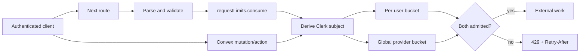

# Per-user rate limiting (NT-16)

Status: proposed. This document selects Path 2, a Convex-backed application limiter. No
dependency, component, runtime gate, schema, deployment, or production configuration has
been changed.

## Decision

Use the official [`@convex-dev/rate-limiter`](https://github.com/get-convex/rate-limiter)
component as the shared request-rate authority. Next route handlers call an authenticated
Convex mutation before cost-bearing work, and direct Convex mutations/actions call the same
policy at their own execution boundary. Every per-user key is derived server-side from the
Clerk identity; a caller never supplies the identity being limited.

This is separate from entitlements. Entitlements answer whether an account may use a
feature at all and continue to return `402` when a permanent free allowance is exhausted.
Rate limits answer whether the caller is using an allowed feature too quickly and return
`429` with retry timing. Paid accounts retain safety limits even though they have no free
allowance counter.

## Goals

- Stop bursts before they spend a model, search, storage, or integration quota.
- Share one user's budget across tabs, devices, sessions, and server instances.
- Protect both Next API routes and cost-bearing Convex functions.
- Preserve current auth, sharing, entitlement, and operator-impersonation boundaries.
- Give explicit actions useful retry timing without making ambient features noisy.
- Add global provider ceilings so many individually valid users cannot exhaust one key.
- Roll out and verify without calling a paid provider.

## Non-goals

- Replacing `FREE_LIMITS` or changing what free and Pro plans include.
- Treating rate limiting as complete DDoS protection; traffic that must be stopped before
  application execution remains an edge/firewall concern.
- Applying a generic limit to ordinary indexed reads or collaborative Yjs traffic.
- Making the public Places photo proxy user-aware. It has no authenticated identity and
  needs a separate IP/JA4 edge rule if abuse appears.
- Adding an ops control or dashboard in the first implementation.

## Current boundary

`proxy.ts` requires a Clerk session for almost every `/api/*` route, but authentication is
not throttling. `/api/complete` checks the one-time completion allowance, and `/api/chat`
charges a conversation once; neither bounds request bursts. Reformat, diagram, album
indexing, feedback helpers, Places, and media search can reach external services without
an application rate check.

Upload URL creation is already centralized in `convex/uploads.ts`, whose contract names
rate limits as a future hardening point. `convex/convex.config.ts` currently mounts only the
ProseMirror Sync and Stripe components. `aiCalls` records requests after model execution,
so it can establish normal request rates but cannot itself enforce a concurrent limit.

## Proposed request flow



The user and global checks execute in one Convex mutation. A refusal throws so the whole
transaction rolls back; one bucket must not consume capacity when the other rejects the
same request.

## Policy model

Define a closed union of bucket names in one server-only module. The initial set should
separate workloads whose legitimate cadence and cost differ:

| Bucket | Initial callers | Unit |
|---|---|---|
| `ambientCompletion` | `/api/complete` | One upstream completion request |
| `ambientTransform` | reformat, categorize, feedback completion | One upstream request |
| `agentGeneration` | chat, diagram, album indexing | One upstream generation |
| `externalLookup` | chargeable Places modes and media search | One provider lookup |
| `uploadGrant` | centralized upload URL creation | One signed upload URL |
| provider-global buckets | each paid provider family | One request, with token accounting deferred |

Use token buckets where a short interaction burst is normal. Fixed windows are acceptable
only for genuinely discrete actions such as upload grants. Do not freeze numeric limits
from intuition: derive an initial high-water mark from per-user `aiCalls`, UI debounce
settings, provider quotas, and manual multi-tab traces. Launch with deliberately generous
safety ceilings, then tighten from observed percentiles.

Special cases:

- Ambient completion is latency-sensitive and can legitimately fire after a 350 ms pause.
  Measure the added Convex mutation at p50 and p95 before enforcement. If it materially
  regresses time-to-first-byte, Path 2 does not pass for that lane; use the Vercel
  application-key limiter for completion rather than weakening enforcement with an
  in-memory cache.
- One chat turn can make several HTTP requests as browser tools are answered. Count every
  provider generation because every one spends the key, but set burst capacity above the
  configured 24-step turn ceiling so one valid turn cannot block itself.
- Limit the invoking collaborator, not the project owner. Shared-project access must not
  let one editor spend or exhaust another person's request bucket.
- Pro may receive a higher product-cadence limit later, but no plan is unlimited from an
  abuse and runaway-cost perspective.

## Implementation plan

The implementation should land as five independently reviewable commits. Tests belong in
the commit that introduces the behavior they protect; do not defer all coverage to a final
test commit. Production observation and enforcement happen after merge as deployment gates,
because traffic evidence is not a source-code change.

### Pre-commit gate — freeze policy and measurements

Inventory every path that can call an external provider or mint an upload URL. Group each
path under a typed bucket and record whether it is ambient, explicit, internally retried,
or multi-step. Establish baseline per-user request rates and current time-to-first-byte
from existing telemetry. Decide the first numeric ceilings and document why normal use
fits beneath them.

Exit gate: every in-scope operation has one bucket, one unit definition, and an explicit
answer for retries, sharing, and entitlement interaction.

### Commit 1 — `feat(rate-limits): add the Convex admission authority`

- Install `@convex-dev/rate-limiter` and mount it in `convex/convex.config.ts`.
- Commit the package manifest, lockfile, component configuration, and generated Convex API
  changes together. Run code generation; never edit `convex/_generated` by hand.
- Add `convex/requestLimits.ts` rather than overloading `convex/limits.ts`, which owns the
  permanent free-plan constants.
- Expose one validated `consume` mutation that accepts only a bucket name, derives the
  Clerk subject through the existing auth helpers, applies the per-user and global checks
  atomically, and returns or throws typed retry information.
- Add an `off | observe | enforce` deployment setting. `observe` consumes and logs the
  policy decision but allows the request; `enforce` rejects it. A limiter outage fails
  closed for paid work with `503`, not open into an unbounded provider call.
- Add Convex tests for same-user concurrency, different-user isolation, atomic user/global
  rejection, retry timing, deployment modes, stand-in refusal, and invoking-collaborator
  attribution.

This commit adds an unused backend capability: no product route calls it yet. That keeps
the dependency, generated surface, auth boundary, transaction semantics, and component
tests reviewable without route or UI noise.

Exit gate: concurrent calls cannot overspend a bucket, callers cannot choose another
user's key, disabling enforcement requires no data deletion, and the existing product
behaves unchanged because there are no consumers.

### Commit 2 — `feat(rate-limits): protect explicit AI generations`

Create `app/lib/requestLimitGate.ts` beside the entitlement gate. It calls the Convex
mutation as the current Clerk session, normalizes component errors, and returns either
`null` or a JSON response:

```json
{ "code": "rate_limit", "bucket": "agentGeneration", "retryAfterMs": 1200 }
```

The response is `429` and includes `Retry-After` rounded up to whole seconds. Auth remains
first. Cheap structural validation occurs before consuming capacity; the gate occurs
before any paid/external call. Limiter infrastructure failure returns `503` and remains
distinct from a real rate refusal.

- Apply `agentGeneration` to `/api/chat`, `/api/diagram`, and `/api/album/index`.
- Count each chat provider generation, while keeping burst capacity above the configured
  24-step ceiling so one valid tool loop cannot block itself.
- Teach the corresponding explicit surfaces to preserve input and show a concise retry
  time. A rate-limited continuation must not duplicate or discard a chat turn.
- Add mocked route/client tests proving that a refusal never invokes the provider, the
  response contract is stable, and the UI can recover without reload.

This is one vertical slice: shared Next gate, expensive explicit routes, their recovery UX,
and their tests land together.

Exit gate: explicit model work is admitted before provider spend; `401`, `402`, `429`, and
`503` remain distinct; a maximum-length chat turn does not block itself.

### Commit 3 — `feat(rate-limits): throttle ambient AI without retry noise`

- Apply `ambientCompletion` to `/api/complete` and `ambientTransform` to
  `/api/reformat`, `/api/categorize`, and `/api/feedback-complete`.
- Suppress ambient requests locally until `Retry-After` expires. Do not toast and do not
  automatically retry.
- Keep the existing permanent completion allowance on `402`; a `429` must never open the
  upgrade path.
- Add mocked tests for cooldown, abort cleanup, no retry herd, and proof that refusals do
  not call or record the provider.
- Record the limiter's p50/p95 contribution to completion time-to-first-byte. Leave
  completion in `observe` if the agreed latency budget is missed and record the Vercel
  keyed-limiter fallback decision rather than adding an in-memory bypass.

This commit isolates the latency-sensitive and intentionally quiet surfaces from explicit
AI UX, making the performance decision easy to review or revert.

Exit gate: ambient lanes back off invisibly, allowance behavior is unchanged, and
completion has a measured latency result before enforcement.

### Commit 4 — `feat(rate-limits): cover lookups, uploads, and direct actions`

- Apply `externalLookup` to chargeable `/api/places` modes and `/api/media/search`, with
  manual-retry feedback on their explicit search surfaces.
- Do not limit the free Places short-link resolver. Keep the public photo route outside
  this per-user design.
- Apply `uploadGrant` at the centralized `convex/uploads.ts` boundary and surface temporary
  refusal wherever a signed upload URL is requested.
- Inventory external Convex actions for albums, Notion, and GitHub. Apply the shared server
  helper immediately before each in-scope external side effect, after current ownership or
  editability checks.
- Make scheduled continuations and internal retries reserve or identify one logical unit;
  they must not consume twice merely because execution crossed functions.
- Add tests for direct-Convex bypass attempts, lookup mode classification, upload refusal,
  shared-project attribution, and retry/idempotency behavior.

This commit completes the non-AI resource boundary without expanding the public photo
route or mixing firewall policy into application policy.

Exit gate: calling a public Convex function directly cannot avoid an in-scope limit, and
all explicit lookup/upload clients recover without losing user input.

### Commit 5 — `docs(rate-limits): finalize rollout and operating guidance`

- Update this document with the final bucket values, measured completion latency, and exact
  list of protected entry points.
- Update the agent wiki's primary-repo, data/auth, AI-system, and runbook pages to match the
  implemented boundary and deployment controls.
- Document how to set `off`, `observe`, and `enforce`, inspect structured decisions, disable
  enforcement without deleting state, and distinguish limiter failure from provider or
  entitlement failure.
- Confirm whether persistent analytics or an ops control remains deferred. If either is
  added, update `nootles-ops/lib/api.ts`, its UI, and the cross-repository contract in the
  same commit.
- Run the full static regression suite and link checker. Record that no paid-provider call
  was made.

This commit contains no new limiter behavior. It makes the completed boundary operable and
keeps durable documentation synchronized with the implementation.

Exit gate: the diff, docs, wiki, environment procedure, and actual protected surface agree.

### Deployment gate A — observe

Deploy the five commits with mode `observe` through at least one representative traffic
window. Log bucket, route, decision, retry delay, and deployment mode without raw user IDs
or request content. Compare would-block events with existing request volume and latency.
No source commit should claim the limits are enforced during this gate.

### Deployment gate B — enforce runaway ceilings

After the observation review:

1. enforce high, runaway-only ceilings on explicit expensive lanes;
2. enforce external lookup and upload grants;
3. enforce ambient transforms;
4. enforce completion only after its latency and false-positive gates pass;
5. add or tighten global provider buckets from actual account quotas and cost budgets.

Changing deployment mode or bucket configuration is an operational action. If observation
requires code or threshold changes, land those as a small follow-up commit with its own
tests and documentation update before enforcing.

### Deployment gate C — tune from evidence

Review false positives, retry behavior, provider spend, and p95 latency after enforcement.
Adjust one bucket family at a time, retain the rollback setting, and record the reason for
each threshold change. Do not make Pro unlimited; product-cadence differences remain
separate from the global safety backstop.

Persistent rate-limit analytics or an operator control is a separate cross-repository
decision because it would change the ops API and UI contract.

## Verification

All verification is static or uses mocked providers.

- Convex tests: same-user concurrency, different-user isolation, per-user plus global
  atomicity, retry timing, observe/enforce/off modes, stand-in refusal, and shared-project
  attribution to the invoking user.
- Route tests: `401`, `402`, `429`, and `503` remain distinct; malformed input does not
  consume; a refused request never reaches the mocked provider; `Retry-After` is present.
- Client tests: ambient cooldown, explicit retry messaging, no retry loop, chat input
  preservation, and no duplicate turn after recovery.
- Regression checks: `npm test`, `npx tsc --noEmit`, `npm run lint`, and `npm run build`.
- No browser path with AI credentials and no live paid-provider request.

## Acceptance criteria

- The same Clerk subject shares limits across tabs, sessions, and server instances.
- One user cannot inspect, consume, or reset another user's bucket.
- Every in-scope external call is admitted before cost is incurred.
- Normal entitlement behavior is unchanged: permanent exhaustion is `402`, temporary
  throttling is `429`, and infrastructure failure is `503`.
- A valid maximum-length chat turn is not blocked by its own internal continuations.
- Ambient UI backs off silently; explicit UI reports when the action may be retried.
- Global ceilings protect provider credentials from aggregate traffic.
- Completion latency remains within the agreed p95 regression budget.
- Documentation and the agent wiki match the implemented scope and rollout state.

## Rollback

Set the deployment mode to `off` to stop checking without removing component state, then
redeploy the affected boundary if the failure is code rather than policy. Do not delete
rate-limit state during an incident. The existing auth and entitlement gates remain active
throughout rollback.

## Alternatives retained

Vercel's user-keyed Rate Limiting SDK remains the fallback for latency-sensitive Next
routes, especially ambient completion. A later defense-in-depth project may add coarse
Vercel IP/JA4 limits ahead of the application, but this plan does not make firewall
configuration a second source of per-user product policy.
